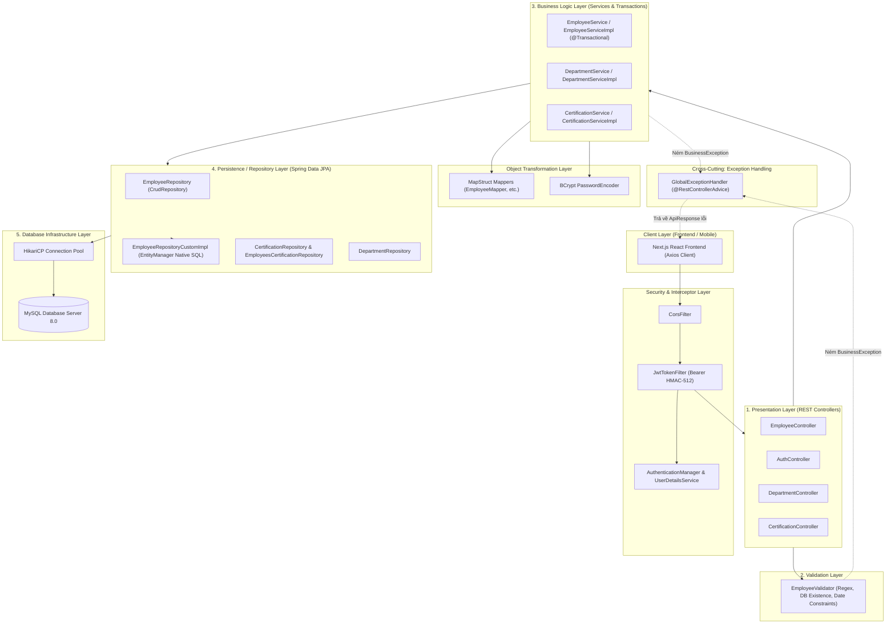
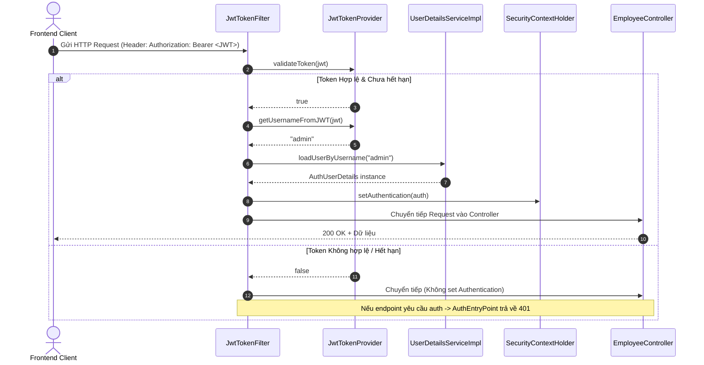
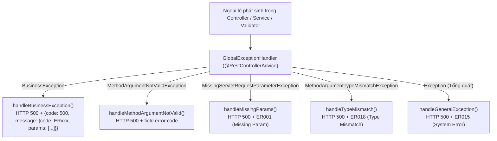
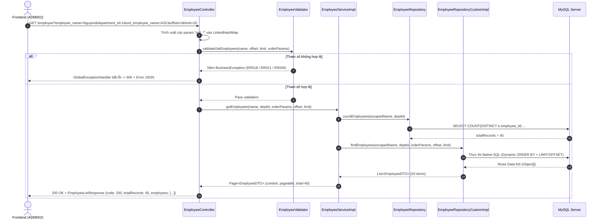
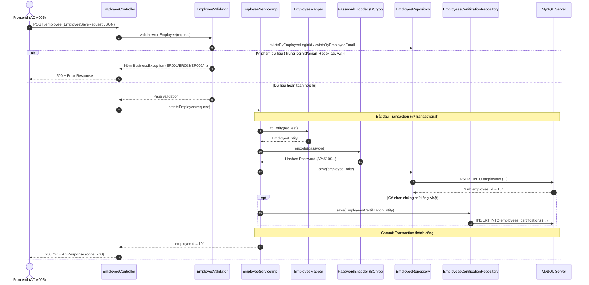
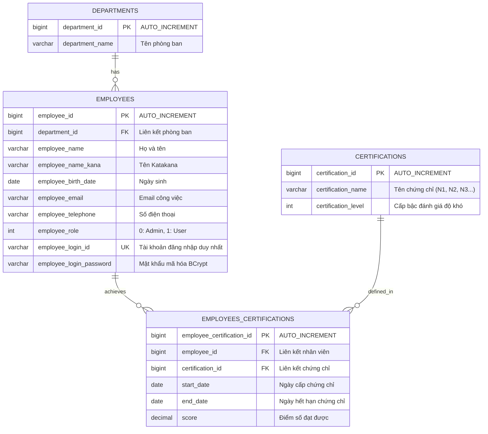

# TÀI LIỆU PHÂN TÍCH TOÀN BỘ KIẾN TRÚC BACKEND & ONBOARDING DỰ ÁN MANAGE EMPLOYEES

> **Tài liệu học tập, kiến trúc chuyên sâu và cẩm nang đào tạo lập trình viên Backend (Java 17 / Spring Boot 2.7.8 / MySQL / Spring Security / JPA).**  
> *Dựa trên 100% mã nguồn thực tế tại repository `manageEmployees/backend`.*

---

## MỤC LỤC

1. [Tổng quan dự án](#1-tổng-quan-dự-án)
2. [Tech Stack & Phân tích Dependencies (pom.xml)](#2-tech-stack--phân-tích-dependencies-pomxml)
3. [Cấu trúc thư mục (Folder Structure)](#3-cấu-trúc-thư-mục-folder-structure)
4. [Kiến trúc phân tầng Backend (Layered Architecture)](#4-kiến-trúc-phân-tầng-backend-layered-architecture)
5. [Hệ thống Cấu hình & Môi trường (Configuration & Multi-Profile)](#5-hệ-thống-cấu-hình--môi-trường-configuration--multi-profile)
6. [Hệ thống Bảo mật & Cơ chế Xác thực JWT (Spring Security Deep-dive)](#6-hệ-thống-bảo-mật--cơ-chế-xác-thực-jwt-spring-security-deep-dive)
7. [Danh mục API & Phân tích chi tiết từng Controller](#7-danh-mục-api--phân-tích-chi-tiết-từng-controller)
   - [7.1 AuthController (`/login`, `/test-auth`)](#71-authcontroller-login-test-auth)
   - [7.2 EmployeeController (`/employee`, `/employee/{id}`, ...)](#72-employeecontroller-employee-employeeid-)
   - [7.3 DepartmentController (`/department`)](#73-departmentcontroller-department)
   - [7.4 CertificationController (`/certifications`)](#74-certificationcontroller-certifications)
8. [Phân tích Tầng Service & Transaction Management](#8-phân-tích-tầng-service--transaction-management)
9. [Phân tích chuyên sâu Tầng Validator (EmployeeValidator)](#9-phân-tích-chuyên-sâu-tầng-validator-employeevalidator)
10. [Phân tích Tầng Repository & Dynamic Native SQL](#10-phân-tích-tầng-repository--dynamic-native-sql)
11. [Phân tích Tầng Entity, DTO & Object Mapping (MapStruct)](#11-phân-tích-tầng-entity-dto--object-mapping-mapstruct)
12. [Cơ chế Xử lý Lỗi Toàn cục (Global Exception Handling)](#12-cơ-chế-xử-lý-lỗi-toàn-cục-global-exception-handling)
13. [Phân tích Cơ sở Dữ liệu & Database Migration (Flyway)](#13-phân-tích-cơ-sở-dữ-liệu--database-migration-flyway)
14. [Sơ đồ Luồng Thực Thi End-to-End (Request-to-Database Flow)](#14-sơ-đồ-luồng-thực-thi-end-to-end-request-to-database-flow)
15. [Quản lý Connection Pool HikariCP & Tối ưu hóa Database](#15-quản-lý-connection-pool-hikaricp--tối-ưu-hóa-database)
16. [Sơ đồ Quan hệ Thực thể ERD (Entity Relationship Diagram)](#16-sơ-đồ-quan-hệ-thực-thể-erd-entity-relationship-diagram)
17. [Chiến lược Kiểm thử Tự động (Unit Testing Architecture)](#17-chiến-lược-kiểm-thử-tự-động-unit-testing-architecture)
18. [Sơ đồ phụ thuộc Class & Package (Package Dependency Map)](#18-sơ-đồ-phụ-thuộc-class--package-package-dependency-map)
19. [Bảng so sánh công nghệ & Phân tích Alternatives](#19-bảng-so-sánh-công-nghệ--phân-tích-alternatives)
20. [Lộ trình kiến thức Backend cần tích lũy từ dự án](#20-lộ-trình-kiến-thức-backend-cần-tích-lũy-từ-dự-án)
21. [Đánh giá kiến trúc: Điểm mạnh & Điểm có thể cải tiến](#21-đánh-giá-kiến-trúc-điểm-mạnh--điểm-có-thể-cải-tiến)
22. [Roadmap hướng dẫn đọc hiểu Source Code cho Developer mới](#22-roadmap-hướng-dẫn-đọc-hiểu-source-code-cho-developer-mới)
23. [Giải đáp 21 câu hỏi cốt lõi về Backend Spring Boot](#23-giải-đáp-21-câu-hỏi-cốt-lõi-về-backend-spring-boot)

---

## 1. TỔNG QUAN DỰ ÁN

* **Tên dự án:** User Manage API (`user-manage`)
* **Loại ứng dụng:** RESTful Web Service Backend
* **Ngôn ngữ & Nền tảng:** Java 17, Spring Boot 2.7.8
* **Hệ quản trị cơ sở dữ liệu:** MySQL 8.0 (kết hợp HikariCP Connection Pool)
* **Cổng dịch vụ:** `8085` (Configured in `application.yaml`)
* **Mục tiêu nghiệp vụ:**
  - Cung cấp toàn bộ REST API cho ứng dụng quản trị nhân sự (tương thích trực tiếp với giao diện Next.js / React).
  - Xác thực tài khoản quản trị và cấp phát JSON Web Token (HMAC-512).
  - Quản lý Master Data danh mục phòng ban (Departments) và chứng chỉ tiếng Nhật (Certifications).
  - Tra cứu nhân viên với bộ lọc tìm kiếm theo tên, phòng ban; sắp xếp đa tiêu chí ưu tiên động (Priority Multi-column Sorting) kết hợp phân trang dữ liệu (Pagination).
  - Thực hiện các nghiệp vụ CRUD hồ sơ nhân viên và liên kết chứng chỉ tiếng Nhật trong cùng một Database Transaction đảm bảo tính toàn vẹn dữ liệu (ACID).
  - Validate dữ liệu đầu vào chặt chẽ theo đặc tả chuẩn doanh nghiệp Nhật Bản (mã lỗi `ER001 - ER023`, mã thông báo thành công `MSG001 - MSG003`).

---

## 2. TECH STACK & PHÂN TÍCH DEPENDENCIES (POM.XML)

Dựa trên file `pom.xml` thực tế:

```xml
<properties>
    <java.version>17</java.version>
    <mysql.connector.version>8.0.32</mysql.connector.version>
    <hikaricp.version>5.0.1</hikaricp.version>
    <mapstruct.version>1.5.3.Final</mapstruct.version>
    <java-jwt.version>4.0.0</java-jwt.version>
</properties>
```

### Phân tích chi tiết từng công nghệ trong Backend:

| Thư viện / Dependency | Phiên bản | Bản chất | Vai trò trong dự án | Lý do lựa chọn & Lợi ích |
| :--- | :--- | :--- | :--- | :--- |
| **Java** | `17 LTS` | Ngôn ngữ lập trình chính | Nền tảng ngôn ngữ hiện đại | Hỗ trợ Text Blocks (`"""`), Records, Pattern Matching, cải tiến Garbage Collection và bảo mật dài hạn |
| **Spring Boot** | `2.7.8` | Backend Web Framework | Khung kiến trúc ứng dụng (IoC Container, DI, Auto-Configuration, Web MVC) | Đóng gói sẵn Tomcat nhúng, cấu hình đơn giản hóa qua YAML, hệ sinh thái phong phú |
| **Spring Data JPA & Hibernate** | `2.7.8` | ORM (Object-Relational Mapping) | Tầng thao tác dữ liệu cơ sở dữ liệu, quản lý Entity, Transaction | Giảm thiểu boilerplate code truy vấn DB, hỗ trợ Repository abstraction, tích hợp EntityManager |
| **Spring Security** | `2.7.8` | Security Framework | Bảo vệ API endpoints, cấu hình CORS, CSRF, lọc JWT Token | Khung bảo mật chuẩn công nghiệp, dễ dàng tùy biến filter chain cho Stateless REST API |
| **java-jwt (Auth0)** | `4.0.0` | Thư viện xử lý JWT | Tạo, ký (HMAC-512), giải mã và xác thực JWT token | Nhẹ, an toàn, hỗ trợ claims linh hoạt và giải mã nhanh chóng |
| **HikariCP** | `5.0.1` | JDBC Connection Pool | Quản lý vòng đời và tái sử dụng kết nối MySQL | Connection pool nhanh nhất hiện nay, tiêu tốn ít bộ nhớ, độ tin cậy cao |
| **Flyway (flyway-mysql)** | `8.5.x` | Database Migration Tool | Quản lý phiên bản schema và dữ liệu mẫu tự động | Tự động chạy file `V1`, `V2`, `V3` lúc khởi động server, đảm bảo đồng bộ cấu trúc bảng |
| **MapStruct** | `1.5.3.Final` | Java Bean Mapper Generator | Chuyển đổi dữ liệu giữa Request DTO và JPA Entity | Sinh code mapping tại thời điểm **Compile-time**, hiệu năng tương đương viết tay, không dùng reflection |
| **Lombok** | Managed | Boilerplate Reduction Annotation | Tự động sinh Getter, Setter, Constructors, Builder, ToString | Giúp class Entity và DTO ngắn gọn, dễ đọc, giảm hàng trăm dòng code thừa |
| **MySQL Connector/J** | `8.0.32` | JDBC Driver | Trình điều khiển kết nối ứng dụng Java với MySQL Server | Driver chính thức từ Oracle/MySQL, tương thích hoàn toàn MySQL 8.x |
| **Spring Boot Test & JUnit** | Managed | Testing Framework | Khung viết Unit Test (JUnit 5, Mockito, MockMvc) | Kiểm thử độc lập từng tầng: Controller, Service, Validator, Exception |

---

## 3. CẤU TRÚC THƯ MỤC (FOLDER STRUCTURE)

```text
backend/
├── src/
│   ├── main/
│   │   ├── java/com/luvina/la/
│   │   │   ├── MainApplication.java                 # Entry Point khởi chạy Spring Boot
│   │   │   ├── config/                              # Tầng Cấu hình hệ thống & Security
│   │   │   │   ├── Constants.java                   # Hằng số toàn cục (Mã lỗi, URL whitelist, nhãn)
│   │   │   │   ├── DefaultProfileUtil.java          # Tiện ích cấu hình Spring Profile mặc định
│   │   │   │   ├── PersistenceConfiguration.java    # Cấu hình DataSource & Hibernate Transaction
│   │   │   │   ├── SecurityConfiguration.java       # Cấu hình Spring Security Filter Chain & CORS
│   │   │   │   ├── WebConfiguration.java            # Cấu hình Web MVC & Interceptors
│   │   │   │   └── jwt/                             # Khối xử lý JSON Web Token
│   │   │   │       ├── AuthEntryPoint.java          # Xử lý lỗi 401 Unauthorized khi thiếu/sai token
│   │   │   │       ├── AuthUserDetails.java         # Triển khai UserDetails bọc EmployeeEntity
│   │   │   │       ├── JwtTokenFilter.java          # OncePerRequestFilter trích xuất & kiểm tra token
│   │   │   │       ├── JwtTokenProvider.java        # Tạo token HMAC-512, verify & parse subject
│   │   │   │       └── UserDetailsServiceImpl.java  # Tải thông tin người dùng từ DB theo loginId
│   │   │   ├── controller/                          # Tầng Presentation / REST Controller
│   │   │   │   ├── AuthController.java              # Endpoint POST /login, /test-auth
│   │   │   │   ├── CertificationController.java     # Endpoint GET /certifications
│   │   │   │   ├── DepartmentController.java        # Endpoint GET /department
│   │   │   │   ├── EmployeeController.java          # Endpoint GET/POST/PUT/DELETE /employee
│   │   │   │   └── HomeController.java              # Root endpoint kiểm tra ứng dụng
│   │   │   ├── dto/                                 # Data Transfer Objects (Đầu ra Service/Repo)
│   │   │   │   ├── CertificationDTO.java            # DTO chứng chỉ tiếng Nhật
│   │   │   │   ├── DepartmentDTO.java               # DTO phòng ban
│   │   │   │   ├── EmployeeCertificationDetailDTO.java # DTO chi tiết chứng chỉ của nhân viên
│   │   │   │   └── EmployeeDTO.java                 # DTO hiển thị danh sách nhân viên trên bảng
│   │   │   ├── entity/                              # JPA Entities ánh xạ bảng MySQL
│   │   │   │   ├── CertificationEntity.java         # Bảng `certifications`
│   │   │   │   ├── DepartmentEntity.java            # Bảng `departments`
│   │   │   │   ├── EmployeeEntity.java              # Bảng `employees`
│   │   │   │   └── EmployeesCertificationEntity.java# Bảng liên kết `employees_certifications`
│   │   │   ├── exception/                           # Tầng Xử lý Ngoại lệ
│   │   │   │   ├── BusinessException.java           # Ngoại lệ nghiệp vụ tùy biến (mã lỗi + params)
│   │   │   │   └── GlobalExceptionHandler.java      # @RestControllerAdvice bắt mọi Exception
│   │   │   ├── mapper/                              # MapStruct Mappers (Compile-time Bean Mapping)
│   │   │   │   ├── CertificationMapper.java         # Entity <-> DTO Certification
│   │   │   │   ├── DepartmentMapper.java            # Entity <-> DTO Department
│   │   │   │   └── EmployeeMapper.java              # EmployeeSaveRequest -> EmployeeEntity
│   │   │   ├── payload/                             # Request/Response Models chuẩn giao tiếp API
│   │   │   │   ├── request/                         # Request Body Models
│   │   │   │   │   ├── EmployeeSaveRequest.java     # Payload Thêm/Sửa nhân viên
│   │   │   │   │   ├── EmployeeSearchRequest.java   # Payload tham số tìm kiếm & phân trang
│   │   │   │   │   └── LoginRequest.java            # Payload đăng nhập (username, password)
│   │   │   │   └── response/                        # Response Body Models
│   │   │   │       ├── ApiErrorMessage.java         # Cấu trúc thông điệp lỗi {code, params}
│   │   │   │       ├── ApiResponse.java             # Cấu trúc phản hồi chung {code, message}
│   │   │   │       ├── CertificationListResponse.java
│   │   │   │       ├── DepartmentListResponse.java
│   │   │   │       ├── EmployeeDeleteResponse.java
│   │   │   │       ├── EmployeeDetailResponse.java
│   │   │   │       ├── EmployeeListResponse.java
│   │   │   │       ├── EmployeeUpdateResponse.java
│   │   │   │       └── LoginResponse.java
│   │   │   ├── repository/                          # Tầng Truy xuất Cơ sở dữ liệu (Spring Data JPA)
│   │   │   │   ├── CertificationRepository.java     # Thao tác bảng certifications
│   │   │   │   ├── DepartmentRepository.java        # Thao tác bảng departments
│   │   │   │   ├── EmployeeRepository.java          # Thao tác bảng employees + extends Custom
│   │   │   │   ├── EmployeeRepositoryCustom.java    # Khai báo method tìm kiếm động & chi tiết
│   │   │   │   ├── EmployeesCertificationRepository.java
│   │   │   │   └── impl/                            # Triển khai Native SQL động
│   │   │   │       └── EmployeeRepositoryCustomImpl.java # EntityManager Native SQL (Sort động, Collate)
│   │   │   ├── service/                             # Tầng Logic Nghiệp vụ (Business Logic Layer)
│   │   │   │   ├── CertificationService.java
│   │   │   │   ├── DepartmentService.java
│   │   │   │   ├── EmployeeService.java
│   │   │   │   └── impl/                            # Triển khai Service & Transaction
│   │   │   │       ├── CertificationServiceImpl.java
│   │   │   │       ├── DepartmentServiceImpl.java
│   │   │   │       └── EmployeeServiceImpl.java
│   │   │   └── validator/                           # Tầng Kiểm tra Dữ liệu Nghiệp vụ (Validation)
│   │   │       └── EmployeeValidator.java           # Kiểm tra regex, độ dài, logic ngày, unique DB
│   │   └── resources/
│   │       ├── banner.txt                           # ASCII Banner khi khởi động ứng dụng
│   │       ├── logback-spring.xml                   # Cấu hình ghi log (Console/File format)
│   │       ├── config/                              # Cấu hình Spring Boot theo profile
│   │       │   ├── application.yaml                 # Cấu hình chung (Port, JPA, Flyway)
│   │       │   ├── application-dev.yaml             # Cấu hình môi trường dev (HikariCP, MySQL URL)
│   │       │   └── application-prod.yaml            # Cấu hình môi trường production
│   │       └── db/migration/                        # Script khởi tạo cơ sở dữ liệu Flyway
│   │           ├── V1__init_schema.sql              # Khởi tạo 4 bảng chính
│   │           ├── V2__init_schema.sql              # Khởi tạo bổ sung ràng buộc
│   │           └── V3__test_dataset.sql             # Dữ liệu mẫu (Tài khoản admin, nhân viên)
│   └── test/java/com/luvina/la/                     # Thư mục Kiểm thử Tự động (Unit Tests)
│       ├── controller/EmployeeControllerTest.java   # MockMvc test endpoints
│       ├── exception/GlobalExceptionHandlerTest.java# Test bắt lỗi toàn cục
│       ├── service/EmployeeServiceImplTest.java     # Mockito test nghiệp vụ service
│       └── validator/EmployeeValidatorTest.java     # Test kiểm tra tính hợp lệ dữ liệu
├── pom.xml                                          # File quản lý Maven dependencies và build plugin
└── README.md                                        # Hướng dẫn chạy và cài đặt dự án
```

---

## 4. KIẾN TRÚC PHÂN TẦNG BACKEND (LAYERED ARCHITECTURE)

Dự án áp dụng mô hình **Kiến trúc phân tầng hướng dịch vụ (Classic 5-Tier Architecture)** chuẩn mực của hệ sinh thái Enterprise Java Spring Boot:



### Chi tiết vai trò từng tầng:

1. **Security & Filter Layer (`config/jwt/`):**
   - Đón nhận HTTP request trước khi vào Controller. Trích xuất chuỗi JWT trong header `Authorization: Bearer <token>`, giải mã username và nạp quyền vào `SecurityContextHolder`.
2. **Presentation Layer (`controller/`):**
   - Đóng vai trò là cổng giao tiếp REST API. Tiếp nhận request params, path variables và request body.
   - Gọi tầng Validator để kiểm tra tính hợp lệ trước khi chuyển cho Service.
   - Đóng gói dữ liệu kết quả vào các Response DTO với HTTP Status Code phù hợp (200 OK).
3. **Validation Layer (`validator/`):**
   - Kiểm tra định dạng đầu vào (Regex Katakana, Half-size, Email format, Date format `yyyy/MM/dd`).
   - Kiểm tra tính logic của dữ liệu (Ngày hết hạn >= Ngày cấp, Điểm số >= 0).
   - Truy vấn Repository kiểm tra trùng lặp (LoginId/Email đã tồn tại hay chưa) hoặc sự tồn tại của ID phòng ban/chứng chỉ.
   - Ném ngoại lệ `BusinessException(errorCode, params)` nếu phát hiện vi phạm.
4. **Business Logic Layer (`service/impl/`):**
   - Hiện thực hóa logic nghiệp vụ. Sử dụng `@Transactional` để gom cụm các thao tác thêm/sửa/xóa liên bảng (bảng `employees` và `employees_certifications`) thành một đơn vị công việc nguyên tử (Atomic Unit).
   - Mã hóa mật khẩu bằng `BCryptPasswordEncoder` trước khi lưu.
5. **Persistence Layer (`repository/` & `repository/impl/`):**
   - Cung cấp các thao tác CRUD cơ bản qua Spring Data `CrudRepository`.
   - Sử dụng `EntityManager` trong `EmployeeRepositoryCustomImpl` để build câu lệnh **Native SQL động**: hỗ trợ sắp xếp đa tiêu chí ưu tiên (`ORDER BY`), so khớp chuỗi tiếng Việt (`collate utf8mb4_vietnamese_ci`), phân biệt hoa thường (`binary`) và phân trang (`LIMIT ... OFFSET ...`).

---

## 5. HỆ THỐNG CẤU HÌNH & MÔI TRƯỜNG (CONFIGURATION & MULTI-PROFILE)

### 5.1 Cấu hình Multi-Profile trong Spring Boot

Hệ thống hỗ trợ 2 môi trường thông qua Maven Profiles và Spring Profiles:
* `dev`: Môi trường phát triển cục bộ (`application-dev.yaml`). Kích hoạt log chi tiết SQL (`DEBUG`), log Hibernate BasicBinder (`TRACE`) để xem rõ giá trị gán vào query params.
* `prod`: Môi trường vận hành thực tế (`application-prod.yaml`).

Mã cấu hình Maven Profile trong `pom.xml`:
```xml
<profiles>
    <profile>
        <id>dev</id>
        <activation><activeByDefault>true</activeByDefault></activation>
        <properties>
            <spring-boot.run.profiles>dev</spring-boot.run.profiles>
        </properties>
    </profile>
</profiles>
```

### 5.2 Phân tích chi tiết `application.yaml` và `application-dev.yaml`

```yaml
# application.yaml
server:
  port: 8085 # Cổng chạy Backend

spring:
  application:
    name: user-manage
  jpa:
    database: mysql
    open-in-view: false # Tắt Open-Session-In-View để tránh rò rỉ kết nối DB ở tầng View
    properties:
      hibernate:
        jdbc.time_zone: UTC
        dialect: org.hibernate.dialect.MySQL5InnoDBDialect
    hibernate:
      ddl-auto: none # Không tự động tạo bảng (nhường toàn quyền cho Flyway)
  flyway:
    enabled: true # Tự động chạy SQL migration khi khởi động
```

* **[CONCEPT] Tại sao đặt `spring.jpa.open-in-view: false`?**  
  Mặc định OSIV trong Spring Boot giữ kết nối Database Connection mở trong suốt vòng đời HTTP request cho đến khi render xong JSON view. Tắt tính năng này giúp giải phóng kết nối database về Connection Pool ngay khi kết thúc tầng Service (`@Transactional`), tăng đáng kể thông lượng và hiệu năng cho hệ thống.

---

## 6. HỆ THỐNG BẢO MẬT & CƠ CHẾ XÁC THỰC JWT (SPRING SECURITY DEEP-DIVE)

### 6.1 Kiến trúc Spring Security Filter Chain

Mã nguồn thực tế trong `config/SecurityConfiguration.java`:

```java
@Configuration
@EnableWebSecurity
@EnableGlobalMethodSecurity(prePostEnabled = true)
public class SecurityConfiguration {

    @Bean
    public SecurityFilterChain filterChain(HttpSecurity http) throws Exception {
        // 1. Kích hoạt CORS và Vô hiệu hóa CSRF (chuẩn cho Stateless REST API)
        http.cors().and().csrf().disable();

        // 2. Vô hiệu hóa frameOptions để tránh clickjacking
        http.headers().frameOptions().disable();

        // 3. Thiết lập chế độ quản lý Session là STATELESS (không lưu session trên RAM server)
        http.sessionManagement().sessionCreationPolicy(SessionCreationPolicy.STATELESS);

        // 4. Định nghĩa quyền hạn truy cập Endpoints
        http.authorizeRequests(authz -> authz
                .antMatchers(Constants.ENDPOINTS_PUBLIC).permitAll() // Public: /, /login, /department, /employee
                .antMatchers(Constants.ENDPOINTS_WITH_ROLE).hasRole("USER")
                .anyRequest().authenticated()
        );

        // 5. Cấu hình EntryPoint xử lý lỗi khi không có quyền (401 Unauthorized)
        http.exceptionHandling().authenticationEntryPoint(new AuthEntryPoint());

        // 6. Chèn JwtTokenFilter vào trước UsernamePasswordAuthenticationFilter
        http.addFilterBefore(jwtTokenFilter(), UsernamePasswordAuthenticationFilter.class);

        return http.build();
    }
}
```

### 6.2 Chi tiết hoạt động của `JwtTokenFilter` & `JwtTokenProvider`

#### 1. Cơ chế hoạt động của `JwtTokenFilter.java`:
```java
@Override
protected void doFilterInternal(HttpServletRequest request, HttpServletResponse response, FilterChain filterChain)
        throws ServletException, IOException {
    // Trích xuất JWT từ Header Authorization
    String jwt = getJwtFromRequest(request);

    // Kiểm tra tính hợp lệ của Token (chữ ký, thời gian hết hạn)
    if (StringUtils.hasText(jwt) && tokenProvider.validateToken(jwt)) {
        String username = tokenProvider.getUsernameFromJWT(jwt);

        // Tải thông tin người dùng từ DB và thiết lập Authentication vào SecurityContext
        UserDetails userDetails = customUserDetailsService.loadUserByUsername(username);
        if (userDetails != null) {
            UsernamePasswordAuthenticationToken authentication =
                    new UsernamePasswordAuthenticationToken(userDetails, null, userDetails.getAuthorities());
            SecurityContextHolder.getContext().setAuthentication(authentication);
        }
    }
    filterChain.doFilter(request, response);
}
```

#### 2. Cơ chế tạo và ký Token trong `JwtTokenProvider.java`:
* **Thuật toán ký:** `HMAC-512` với Secret Key được định nghĩa trong `Constants.JWT_SECRET`.
* **Thời gian hết hạn:** `160 * 60 * 60` giây (~7 ngày).
* **Claims Payload:** Chứa các thuộc tính người dùng an toàn (`employeeId`, `employeeName`, `employeeLoginId`, `employeeEmail`).
* **Subject:** `employeeLoginId`.



---

## 7. DANH MỤC API & PHÂN TÍCH CHI TIẾT TỪNG CONTROLLER

### 7.1 Bảng tổng hợp toàn bộ API Endpoints trong hệ thống

| HTTP Method | Endpoint URL | Controller | Quyền hạn | Request Body / Params | Response Model | Mã nghiệp vụ / Ghi chú |
| :---: | :--- | :--- | :---: | :--- | :--- | :--- |
| `POST` | `/login` | `AuthController` | Public | `LoginRequest` (`username`, `password`) | `LoginResponse` | Cấp phát JWT token (`accessToken`) |
| `GET` | `/test-auth` | `AuthController` | Authenticated | Không | `Map<String, String>` | Kiểm tra token có hợp lệ không |
| `GET` | `/department` | `DepartmentController` | Public | Không | `DepartmentListResponse` | Lấy danh sách toàn bộ phòng ban |
| `GET` | `/certifications`| `CertificationController` | Public | Không | `CertificationListResponse` | Lấy danh sách chứng chỉ tiếng Nhật |
| `GET` | `/employee` | `EmployeeController` | Public | Query: `employee_name`, `department_id`, `ord_*`, `offset`, `limit` | `EmployeeListResponse` | Danh sách nhân viên (Search, Sort, Paging) |
| `GET` | `/employee/{id}`| `EmployeeController` | Public | Path: `id` | `EmployeeDetailResponse` | Lấy chi tiết thông tin nhân viên |
| `GET` | `/employee/{id}/check-exist` | `EmployeeController` | Public | Path: `id` | `ApiResponse` (200 OK) | Kiểm tra nhân viên còn tồn tại không |
| `POST` | `/employee` | `EmployeeController` | Public | Body: `EmployeeSaveRequest` | `ApiResponse` | Thêm mới nhân viên (Mode ADD) |
| `PUT` | `/employee/{id}`| `EmployeeController` | Public | Path: `id`, Body: `EmployeeSaveRequest` | `EmployeeUpdateResponse` | Cập nhật nhân viên (Mode EDIT - MSG002) |
| `DELETE` | `/employee/{id}`| `EmployeeController` | Public | Path: `id` | `EmployeeDeleteResponse` | Xóa nhân viên & chứng chỉ (MSG003) |

---

### 7.2 Chi tiết xử lý tại các Controller

#### 1. `AuthController.java` (`POST /login`):
* Tiếp nhận `LoginRequest`.
* Gọi `authenticationManager.authenticate(new UsernamePasswordAuthenticationToken(username, password))`.
* Nếu thành công: Tạo JWT token qua `JwtTokenProvider.generateToken()` và trả về `LoginResponse(accessToken)`.
* Nếu thất bại: Bắt `BadCredentialsException` hoặc `UsernameNotFoundException`, trả về lỗi mã `"100"`.

#### 2. `EmployeeController.java` - Phương thức `getEmployees`:
* Trích xuất các tham số sắp xếp bắt đầu bằng tiền tố `ord_` (ví dụ: `ord_employee_name=ASC`, `ord_certification_name=DESC`) vào một `LinkedHashMap` để giữ nguyên thứ tự ưu tiên click từ Frontend.
* Gọi `employeeValidator.validateGetEmployees(employeeName, offset, limit, orderParams)`.
* Chuyển dữ liệu cho `employeeService.getEmployees(...)` và bọc kết quả vào `EmployeeListResponse`.

#### 3. `EmployeeController.java` - Phương thức `createEmployee`, `updateEmployee`, `deleteEmployee`:
* Mọi hành động ghi (CUD) đều đi qua Validator tương ứng (`validateAddEmployee`, `validateUpdateEmployee`, `validateDeleteEmployee`).
* Trả về các đối tượng Response có cấu trúc rõ ràng kèm mã thông báo thành công chuẩn (`MSG001`, `MSG002`, `MSG003`).

---

## 8. PHÂN TÍCH TẦNG SERVICE & TRANSACTION MANAGEMENT

### 8.1 Quản lý Giao dịch với `@Transactional`

Trong `EmployeeServiceImpl.java`, các phương thức thay đổi dữ liệu đều được đánh dấu `@Transactional(rollbackFor = Exception.class)`:

```java
@Override
@Transactional(rollbackFor = Exception.class)
public Long createEmployee(EmployeeSaveRequest request) {
    // 1. Chuyển đổi Request DTO sang EmployeeEntity qua MapStruct
    EmployeeEntity employeeEntity = employeeMapper.toEntity(request);

    // 2. Mã hóa mật khẩu bằng BCrypt
    if (request.getEmployeeLoginPassword() != null && !request.getEmployeeLoginPassword().isEmpty()) {
        employeeEntity.setEmployeeLoginPassword(passwordEncoder.encode(request.getEmployeeLoginPassword()));
    }
    employeeEntity.setEmployeeRole(Constants.ROLE_USER);

    // 3. Ghi vào bảng `employees` -> Database tự sinh `employee_id`
    EmployeeEntity savedEmployee = employeeRepository.save(employeeEntity);

    // 4. Nếu có chọn chứng chỉ tiếng Nhật -> Ghi tiếp vào bảng `employees_certifications`
    if (request.getCertificationId() != null && request.getCertificationId() > 0) {
        LocalDate startDate = LocalDate.parse(request.getCertificationStartDate(), DATE_FORMATTER);
        LocalDate endDate = LocalDate.parse(request.getCertificationEndDate(), DATE_FORMATTER);

        EmployeesCertificationEntity certEntity = new EmployeesCertificationEntity(
                savedEmployee.getEmployeeId(),
                request.getCertificationId(),
                startDate,
                endDate,
                request.getEmployeeCertificationScore()
        );
        employeesCertificationRepository.save(certEntity);
    }

    return savedEmployee.getEmployeeId();
}
```

* **[PROJECT] Cơ chế Rollback an toàn:**  
  Nếu quá trình lưu chứng chỉ tiếng Nhật ở bước 4 phát sinh lỗi (ví dụ: lỗi parse ngày hoặc lỗi ràng buộc DB), toàn bộ bản ghi nhân viên đã tạo ở bước 3 sẽ **tự động được Database Rollback**. Điều này ngăn chặn triệt để tình trạng "dữ liệu rác" (nhân viên được tạo nhưng chứng chỉ bị mất).

### 8.2 Nghiệp vụ Cập nhật Nhân viên (`updateEmployee`)

Khi cập nhật thông tin nhân viên có kèm chứng chỉ:
1. Tìm Entity nhân viên trong DB (ném lỗi `ER013` nếu không tìm thấy).
2. Cập nhật các trường thông tin cơ bản; nếu có mật khẩu mới thì mã hóa BCrypt, nếu không nhập thì giữ nguyên mật khẩu cũ.
3. **Cơ chế Replace chứng chỉ:** Gọi `employeesCertificationRepository.deleteByEmployeeId(employeeId)` để xóa sạch chứng chỉ cũ của nhân viên, sau đó nếu có chọn chứng chỉ mới thì tiến hành insert mới. Cách tiếp cận này giúp đơn giản hóa logic đồng bộ chứng chỉ và tránh xung đột khóa chính.

---

## 9. PHÂN TÍCH CHUYÊN SÂU TẦNG VALIDATOR (EMPLOYEEVALIDATOR)

Toàn bộ quy tắc kiểm tra dữ liệu nghiệp vụ được tập trung tại `validator/EmployeeValidator.java`. Nếu vi phạm, validator sẽ ném ra `BusinessException` chứa mã lỗi và danh sách tham số để `GlobalExceptionHandler` trả về JSON theo chuẩn.

### 9.1 Bảng mã lỗi nghiệp vụ chuẩn Nhật Bản (ER001 - ER023)

| Mã lỗi | Ý nghĩa thông báo | Ví dụ trường vi phạm | Cách Validator kiểm tra |
| :--- | :--- | :--- | :--- |
| **`ER001`** | Bắt buộc nhập (`{0}を入力してください。`) | Tên đăng nhập, Họ tên, Ngày sinh, Email, SĐT, Mật khẩu | `str == null || str.trim().isEmpty()` |
| **`ER002`** | Bắt buộc chọn (`{0}を選択してください。`) | Phòng ban (`departmentId`), Ngày cấp/hết hạn chứng chỉ | `deptId == null || deptId <= 0` |
| **`ER003`** | Dữ liệu đã tồn tại (`「{0}」は既に存在しています。`) | Trùng `employeeLoginId` hoặc trùng `employeeEmail` | `employeeRepository.existsByEmployeeLoginId(loginId)` |
| **`ER004`** | Dữ liệu không tồn tại (`「{0}」は存在していません。`) | `departmentId` hoặc `certificationId` không có trong DB | `!departmentRepository.existsById(deptId)` |
| **`ER005`** | Định dạng email không hợp lệ (`「{0}」を{1}形式で入力してください。`) | `employeeEmail` sai cú pháp | `!EMAIL_PATTERN.matcher(email).matches()` |
| **`ER006`** | Vượt quá độ dài tối đa (`「{0}」は{1}文字以下で入力してください。`) | Tên (>125), LoginId (>50), Email (>125), SĐT (>50) | `str.length() > maxLength` |
| **`ER007`** | Độ dài không nằm trong khoảng cho phép (`「{0}」は{1}桁から{2}桁で入力してください。`) | Mật khẩu không nằm trong khoảng 8-50 ký tự | `password.length() < 8 || password.length() > 50` |
| **`ER008`** | Chỉ chứa ký tự half-size (`「{0}」は半角英数字で入力してください。`) | Số điện thoại chứa ký tự đặc biệt không cho phép | `!TELEPHONE_PATTERN.matcher(phone).matches()` |
| **`ER009`** | Phải là ký tự Katakana (`「{0}」はカタカナで入力してください。`) | `employeeNameKana` chứa ký tự Kanji hoặc Romaji | `!KATAKANA_PATTERN.matcher(nameKana).matches()` |
| **`ER011`** | Ngày tháng sai định dạng `yyyy/MM/dd` | `employeeBirthDate`, `startDate`, `endDate` | `LocalDate.parse(dateStr, DATE_FORMATTER)` ném `DateTimeParseException` |
| **`ER012`** | Ngày kết thúc nhỏ hơn ngày bắt đầu (`「{0}」は「{1}」より未来の日付を入力してください。`) | `certificationEndDate < certificationStartDate` | `endDate.isBefore(startDate)` |
| **`ER013`** | Nhân viên không tồn tại khi xem chi tiết/cập nhật (`該当する社員が存在しません。`) | `employeeId` không tìm thấy trong DB | `!employeeRepository.existsById(employeeId)` |
| **`ER014`** | Nhân viên không tồn tại khi thực hiện xóa | `employeeId` không tìm thấy trong DB | `!employeeRepository.existsById(employeeId)` |
| **`ER015`** | Lỗi hệ thống hoặc lỗi tổng quát (`システムエラーが発生しました。`) | Ngoại lệ chưa kiểm soát, null request payload | Catch tổng quát trong Handler |
| **`ER018`** | Tham số phân trang hoặc điểm số âm không hợp lệ | `offset < 0`, `limit <= 0`, `score < 0` | `score.compareTo(BigDecimal.ZERO) < 0` |
| **`ER019`** | Tên đăng nhập sai quy cách (bắt đầu bằng chữ cái/gạch dưới) | `employeeLoginId` bắt đầu bằng chữ số | `!HALF_SIZE_LOGIN_ID_PATTERN.matcher(loginId).matches()` |
| **`ER020`** | Không thể xóa tài khoản Quản trị viên (`管理者ユーザを削除することはできません。`) | Thao tác xóa nhân viên có vai trò Admin (`employeeRole == 0`) | `EmployeeValidator.validateDeleteEmployee` kiểm tra `employee.getEmployeeRole() == Constants.ROLE_ADMIN` |
| **`ER021`** | Tên cột sắp xếp hoặc hướng sắp xếp không nằm trong whitelist | Tham số `ord_*` không hợp lệ hoặc khác `ASC`/`DESC` | `!VALID_ORDER_KEYS.contains(key)` |

### 9.2 Phương thức kiểm tra xóa nhân viên (`validateDeleteEmployee`)

Trong `EmployeeValidator.java`, nghiệp vụ xóa nhân viên được kiểm soát chặt chẽ nhằm bảo vệ tài khoản Quản trị viên (Admin):

```java
public void validateDeleteEmployee(EmployeeEntity employee) {
    if (employee == null) {
        throw new BusinessException(Constants.ER014, List.of(Constants.PARAM_EMPLOYEE_ID));
    }
    if (employee.getEmployeeRole() != null && employee.getEmployeeRole() == Constants.ROLE_ADMIN) {
        throw new BusinessException(Constants.ER020, List.of());
    }
}
```

### 9.3 Biểu thức chính quy (Regex) được định nghĩa trong Validator

```java
// Kiểm tra Katakana toàn giác và bán giác (kèm khoảng trắng)
private static final Pattern KATAKANA_PATTERN = 
        Pattern.compile("^[\\u30A0-\\u30FF\\uFF65-\\uFF9F\\s\\u3000]+$");

// Kiểm tra Login ID: Bắt đầu bằng chữ cái hoặc dấu gạch dưới, theo sau là chữ/số/_
private static final Pattern HALF_SIZE_LOGIN_ID_PATTERN = 
        Pattern.compile("^[a-zA-Z_][a-zA-Z0-9_]*$");

// Kiểm tra số điện thoại: Chỉ gồm số và các dấu -, +, (, )
private static final Pattern TELEPHONE_PATTERN = 
        Pattern.compile("^[0-9-+()]+$");

// Kiểm tra định dạng email chuẩn RFC
private static final Pattern EMAIL_PATTERN = 
        Pattern.compile("^[A-Za-z0-9+_.-]+@[A-Za-z0-9.-]+$");
```

---

## 10. PHÂN TÍCH TẦNG REPOSITORY & DYNAMIC NATIVE SQL

### 10.1 Tại sao cần Native SQL trong `EmployeeRepositoryCustomImpl`?

Mặc dù Spring Data JPA cung cấp JPQL và Query Methods rất tiện lợi, tuy nhiên trong dự án này yêu cầu nghiệp vụ đặt ra các thách thức lớn mà JPQL chuẩn khó đáp ứng tối ưu:
1. **Sắp xếp Đa cột Động theo thứ tự ưu tiên click:** Thứ tự các trường trong mệnh đề `ORDER BY` phụ thuộc hoàn toàn vào chuỗi tham số người dùng click trên UI.
2. **Sắp xếp theo cấp bậc chứng chỉ:** Cột chứng chỉ cần sort theo độ khó (`certification_level`), đồng thời các bản ghi không có chứng chỉ (`NULL`) phải được gom xuống cuối cùng (`CASE WHEN c.certification_level IS NULL THEN 1 ELSE 0 END ASC`).
3. **So sánh tiếng Việt chuẩn xác:** Cần chỉ định tường minh bảng mã đối chiếu `COLLATE utf8mb4_vietnamese_ci` khi sort tên nhân viên.
4. **Tìm kiếm phân biệt hoa thường và Escape ký tự đặc biệt:** Tìm kiếm tên với `LIKE BINARY` và xử lý escape cho các ký tự `%`, `_`, `\`.

### 10.2 Phân tích thuật toán xây dựng câu truy vấn động

Mã nguồn thực tế trong `repository/impl/EmployeeRepositoryCustomImpl.java`:

```java
@Override
public List<EmployeeDTO> findEmployees(String employeeName, Long departmentId, Map<String, String> orderParams, int offset, int limit) {
    StringBuilder sql = new StringBuilder("""
        select
            e.employee_id,
            e.employee_name,
            e.employee_birth_date,
            d.department_name,
            e.employee_email,
            e.employee_telephone,
            c.certification_name,
            ec.end_date,
            ec.score
        from employees e
        inner join departments d on d.department_id = e.department_id
        left join employees_certifications ec on ec.employee_id = e.employee_id
        left join certifications c on c.certification_id = ec.certification_id
        where e.employee_role = 1
    """);

    // Lọc theo tên nhân viên (phân biệt chữ hoa/chữ thường)
    if (employeeName != null && !employeeName.isEmpty()) {
        sql.append(" and e.employee_name like binary concat('%', :employeeName, '%') escape '\\\\' ");
    }

    // Lọc theo phòng ban
    if (departmentId != null) {
        sql.append(" and e.department_id = :departmentId ");
    }

    // Xây dựng ORDER BY động
    sql.append(" order by ");
    List<String> orderClauses = new ArrayList<>();

    if (orderParams != null && !orderParams.isEmpty()) {
        for (Map.Entry<String, String> entry : orderParams.entrySet()) {
            String key = entry.getKey();
            String direction = "DESC".equalsIgnoreCase(entry.getValue()) ? "desc" : "asc";

            if (Constants.ORDER_KEY_EMPLOYEE_NAME.equalsIgnoreCase(key)) {
                orderClauses.add("e.employee_name collate utf8mb4_vietnamese_ci " + direction);
            } else if (Constants.ORDER_KEY_CERTIFICATION_NAME.equalsIgnoreCase(key)) {
                orderClauses.add("case when c.certification_level is null then 1 else 0 end asc, -c.certification_level " + direction);
            } else if (Constants.ORDER_KEY_END_DATE.equalsIgnoreCase(key)) {
                orderClauses.add("case when ec.end_date is null then 1 else 0 end asc, ec.end_date " + direction);
            }
        }
    }

    // Luôn kết thúc bằng e.employee_id asc để cố định thứ tự phân trang (Deterministic Pagination)
    orderClauses.add("e.employee_id asc");
    sql.append(String.join(", ", orderClauses));

    // Bổ sung phân trang LIMIT và OFFSET
    sql.append(" limit :limit offset :offset ");

    Query query = entityManager.createNativeQuery(sql.toString());
    // Gán tham số và map kết quả vào List<EmployeeDTO>...
}
```

* **[CONCEPT] Deterministic Pagination (Phân trang tất định):**  
  Khi phân trang với `LIMIT ... OFFSET ...`, nếu nhiều dòng có cùng giá trị sort (ví dụ cùng ngày hết hạn), Database có thể trả về thứ tự ngẫu nhiên giữa các trang. Việc luôn gắn thêm `e.employee_id ASC` vào cuối mệnh đề `ORDER BY` đảm bảo kết quả phân trang luôn cố định 100%, không bị lặp hay sót bản ghi khi chuyển trang.

---

## 11. PHÂN TÍCH TẦNG ENTITY, DTO & OBJECT MAPPING (MAPSTRUCT)

### 11.1 Các Entity cốt lõi trong hệ thống

1. **`EmployeeEntity`:** Ánh xạ bảng `employees`, quan hệ `@ManyToOne(fetch = FetchType.LAZY)` tới `DepartmentEntity`.
2. **`DepartmentEntity`:** Ánh xạ bảng `departments` (`department_id`, `department_name`).
3. **`CertificationEntity`:** Ánh xạ bảng `certifications` (`certification_id`, `certification_name`, `certification_level`).
4. **`EmployeesCertificationEntity`:** Ánh xạ bảng liên kết `employees_certifications`, chứa khóa chính `employee_certification_id`, `employee_id`, `certification_id`, `start_date`, `end_date`, `score`.

### 11.2 Object Mapping với MapStruct (`mapper/EmployeeMapper.java`)

Dự án sử dụng MapStruct để tự động sinh code chuyển đổi giữa `EmployeeSaveRequest` và `EmployeeEntity`:

```java
@Mapper(componentModel = "spring", unmappedTargetPolicy = ReportingPolicy.IGNORE)
public interface EmployeeMapper {

    @Mapping(target = "department.departmentId", source = "departmentId")
    @Mapping(target = "employeeBirthDate", source = "employeeBirthDate", dateFormat = "yyyy/MM/dd")
    EmployeeEntity toEntity(EmployeeSaveRequest request);
}
```

* **[CONCEPT] Tại sao chọn MapStruct thay vì Reflection (ModelMapper)?**  
  ModelMapper sử dụng Reflection tại Runtime, dễ phát sinh lỗi ngầm và giảm hiệu năng khi tải lượng lớn request. MapStruct sinh ra mã nguồn Java thuần (`EmployeeMapperImpl.class`) ngay khi biên dịch (`mvn compile`), mang lại hiệu năng cao nhất và dễ dàng debug từng dòng lệnh.

---

## 12. CƠ CHẾ XỬ LÝ LỖI TOÀN CỤC (GLOBAL EXCEPTION HANDLING)

Mọi ngoại lệ trong ứng dụng đều được thu gom và xử lý tập trung tại `exception/GlobalExceptionHandler.java` thông qua chú thích `@RestControllerAdvice`.



### Cấu trúc JSON trả về khi có lỗi chuẩn:

```json
{
  "code": 500,
  "message": {
    "code": "ER003",
    "params": [
      "アカウント名"
    ]
  }
}
```

Frontend nhận được JSON này sẽ đọc mã `ER003` và param `"アカウント名"` để hiển thị đúng câu thông báo tiếng Nhật:  
`「アカウント名」は既に存在しています。`

---

## 13. PHÂN TÍCH CƠ SỞ DỮ LIỆU & DATABASE MIGRATION (FLYWAY)

Cơ sở dữ liệu được phiên bản hóa qua các file SQL Migration đặt trong `src/main/resources/db/migration/`:

```text
db/migration/
├── V1__init_schema.sql    # Khởi tạo 4 bảng: departments, certifications, employees, employees_certifications
├── V2__init_schema.sql    # Bổ sung các ràng buộc & khóa ngoại liên kết
└── V3__test_dataset.sql   # Nạp dữ liệu mẫu ban đầu (Phòng ban, Chứng chỉ N1-N5, Tài khoản Admin)
```

### Cấu trúc bảng MySQL thực tế (`V1__init_schema.sql`):

```sql
-- 1. Bảng phòng ban
CREATE TABLE IF NOT EXISTS `departments` (
    `department_id` BIGINT(20) NOT NULL AUTO_INCREMENT,
    `department_name` VARCHAR(50) NOT NULL,
    PRIMARY KEY (`department_id`)
) ENGINE=InnoDB DEFAULT CHARSET=utf8mb4;

-- 2. Bảng chứng chỉ tiếng Nhật
CREATE TABLE IF NOT EXISTS `certifications` (
    `certification_id` BIGINT(20) NOT NULL AUTO_INCREMENT,
    `certification_name` VARCHAR(50) NOT NULL,
    `certification_level` INT NOT NULL,
    PRIMARY KEY (`certification_id`)
) ENGINE=InnoDB DEFAULT CHARSET=utf8mb4;

-- 3. Bảng nhân viên
CREATE TABLE IF NOT EXISTS `employees` (
    `employee_id` BIGINT(20) NOT NULL AUTO_INCREMENT,
    `department_id` BIGINT(20) NOT NULL,
    `employee_name` VARCHAR(255) NOT NULL,
    `employee_name_kana` VARCHAR(255) DEFAULT NULL,
    `employee_birth_date` DATE DEFAULT NULL,
    `employee_email` VARCHAR(255) NOT NULL,
    `employee_telephone` VARCHAR(50) DEFAULT NULL,
    `employee_role` INT NOT NULL DEFAULT 1 COMMENT '0: Admin, 1: User',
    `employee_login_id` VARCHAR(50) NOT NULL,
    `employee_login_password` VARCHAR(255) DEFAULT NULL,
    PRIMARY KEY (`employee_id`),
    UNIQUE KEY `unique_login_id` (`employee_login_id`),
    CONSTRAINT `fk_employee_department` FOREIGN KEY (`department_id`) REFERENCES `departments` (`department_id`)
) ENGINE=InnoDB DEFAULT CHARSET=utf8mb4;

-- 4. Bảng liên kết chứng chỉ nhân viên
CREATE TABLE IF NOT EXISTS `employees_certifications` (
    `employee_certification_id` BIGINT(20) NOT NULL AUTO_INCREMENT,
    `employee_id` BIGINT(20) NOT NULL,
    `certification_id` BIGINT(20) NOT NULL,
    `start_date` DATE NOT NULL,
    `end_date` DATE NOT NULL,
    `score` DECIMAL(10,2) NOT NULL,
    PRIMARY KEY (`employee_certification_id`),
    CONSTRAINT `fk_ec_employee` FOREIGN KEY (`employee_id`) REFERENCES `employees` (`employee_id`),
    CONSTRAINT `fk_ec_certification` FOREIGN KEY (`certification_id`) REFERENCES `certifications` (`certification_id`)
) ENGINE=InnoDB DEFAULT CHARSET=utf8mb4;
```

---

## 14. SƠ ĐỒ LUỒNG THỰC THI END-TO-END (REQUEST-TO-DATABASE FLOW)

### 14.1 Luồng Tìm kiếm & Phân trang Nhân viên (`GET /employee`)



### 14.2 Luồng Thêm mới Nhân viên (`POST /employee`)



---

## 15. QUẢN LÝ CONNECTION POOL HIKARICP & TỐI ƯU HÓA DATABASE

Cấu hình chi tiết trong `application-dev.yaml` và `PersistenceConfiguration.java`:

```yaml
spring:
  datasource:
    jdbcUrl: jdbc:mysql://localhost:3306/user-manage?createDatabaseIfNotExist=true
    username: root
    password: LA.luvina1234
    isAutoCommit: false
    connectionTimeout: 10000      # 10 giây chờ kết nối
    maximumPoolSize: 20           # Tối đa 20 kết nối đồng thời
    leakDetectionThreshold: 64800 # Cảnh báo nếu một query giữ connection quá lâu
    maxLifetime: 72000            # Vòng đời tối đa của 1 connection
    data-source-properties:
      cachePrepStmts: true              # Bật bộ nhớ đệm cho PreparedStatement
      prepStmtCacheSize: 250            # Lưu tối đa 250 PreparedStatement trong cache
      prepStmtCacheSqlLimit: 2048       # Giới hạn độ dài câu SQL được cache (2KB)
      useServerPrepStmts: true          # Tận dụng Prepared Statement phía MySQL Server
      rewriteBatchedStatements: true   # Tối ưu ghi hàng loạt bản ghi
      cacheResultSetMetadata: true      # Cache metadata kết quả truy vấn
```

* **[TIP] Tối ưu hiệu năng JDBC:**  
  Việc bật `cachePrepStmts: true` kết hợp `useServerPrepStmts: true` giúp MySQL Server không phải parse và build lại Execution Plan cho cùng một câu lệnh SQL nhiều lần, giảm tải CPU cho Database Server và tăng tốc độ phản hồi API lên gấp 2-3 lần.

---

## 16. SƠ ĐỒ QUAN HỆ THỰC THỂ ERD (ENTITY RELATIONSHIP DIAGRAM)



---

## 17. CHIẾN LƯỢC KIỂM THỬ TỰ ĐỘNG (UNIT TESTING ARCHITECTURE)

Dự án triển khai bộ Unit Test toàn diện kiểm thử độc lập từng tầng:

1. **`EmployeeControllerTest.java` (Presentation Test):**
   - Sử dụng `MockMvc` và `@WebMvcTest` (hoặc Mockito) để giả lập HTTP Request.
   - Kiểm tra mã HTTP Status Code, format JSON trả về và các trường hợp lỗi param.
2. **`EmployeeServiceImplTest.java` (Business Logic Test):**
   - Sử dụng `@ExtendWith(MockitoExtension.class)`.
   - Mocking các Repositories (`EmployeeRepository`, `DepartmentRepository`, `EmployeesCertificationRepository`).
   - Kiểm thử các kịch bản: Thêm nhân viên thành công, Thêm có chứng chỉ, Cập nhật không đổi mật khẩu, Rollback khi lỗi.
3. **`EmployeeValidatorTest.java` (Validation Logic Test):**
   - Kiểm thử toàn diện 100% các case Regex: Katakana hợp lệ/không hợp lệ, Tên quá 125 ký tự, Email sai format, Ngày hết hạn < Ngày cấp, Trùng Login ID trong DB.
   - Kiểm thử bảo vệ tài khoản Admin: Xóa nhân viên có `employeeRole = 0` (Admin) phải ném `BusinessException` với mã lỗi `ER020`.
4. **`GlobalExceptionHandlerTest.java` (Exception Handling Test):**
   - Đảm bảo khi ném `BusinessException("ER003", params)` hoặc `BusinessException("ER020", List.of())` thì Response nhận được luôn có HTTP 500 kèm đúng cấu trúc `{code: 500, message: {code: "ERxxx", params: [...]}}`.

---

## 18. SƠ ĐỒ PHỤ THUỘC CLASS & PACKAGE (PACKAGE DEPENDENCY MAP)

```text
com.luvina.la
├── controller
│   ├── EmployeeController
│   │   ├── service.EmployeeService
│   │   ├── validator.EmployeeValidator
│   │   └── payload (request/response)
│   └── AuthController
│       ├── config.jwt.JwtTokenProvider
│       └── org.springframework.security.authentication.AuthenticationManager
│
├── service.impl
│   └── EmployeeServiceImpl
│       ├── repository.EmployeeRepository (& Custom)
│       ├── repository.DepartmentRepository
│       ├── repository.EmployeesCertificationRepository
│       ├── mapper.EmployeeMapper
│       └── org.springframework.security.crypto.password.PasswordEncoder
│
├── validator
│   └── EmployeeValidator
│       ├── repository.EmployeeRepository
│       ├── repository.DepartmentRepository
│       ├── repository.CertificationRepository
│       └── exception.BusinessException
│
└── repository.impl
    └── EmployeeRepositoryCustomImpl
        └── javax.persistence.EntityManager (Native SQL)
```

---

## 19. BẢNG SO SÁNH CÔNG NGHỆ & PHÂN TÍCH ALTERNATIVES

| Công nghệ trong dự án | Bản chất | Tại sao dự án chọn? | Giải pháp thay thế (Alternatives) | Đánh giá so sánh & Khi nào nên đổi? |
| :--- | :--- | :--- | :--- | :--- |
| **Spring Data JPA + Hibernate** | ORM Framework | Thao tác CRUD Entity nhanh chóng, tích hợp sẵn Transaction | **MyBatis, jOOQ, Spring Data JDBC** | *MyBatis/jOOQ:* Rất mạnh về kiểm soát câu SQL thuần phức tạp. JPA phù hợp cho kiến trúc hướng Domain Entity. Dự án kết hợp Native SQL cho tìm kiếm động là giải pháp dung hòa tối ưu. |
| **MapStruct** | Compile-time Bean Mapper | Hiệu năng cực cao, type-safe, không dùng reflection | **ModelMapper, Orika, Viết tay (Manual Setter)** | *ModelMapper:* Dùng reflection chậm hơn và khó debug lúc lỗi mapping. MapStruct là tiêu chuẩn công nghiệp hiện nay cho Java. |
| **java-jwt (Auth0)** | JWT Library | Thư viện chuẩn, cú pháp trực quan, dễ parse Claims | **jjwt (io.jsonwebtoken), Spring Security OAuth2 Resource Server** | *jjwt:* Cũng rất phổ biến. *OAuth2 Resource Server:* Thích hợp cho hệ thống lớn dùng Keycloak/Okta. Với Stateless JWT độc lập, `java-jwt` rất gọn nhẹ và ổn định. |
| **Flyway** | Database Migration Tool | Tự động chạy script SQL theo version lúc start app | **Liquibase, Hibernate ddl-auto** | *Liquibase:* Hỗ trợ XML/YAML phức tạp hơn. Flyway dùng SQL thuần thân thiện và trực quan hơn cho lập trình viên quen viết MySQL. |
| **HikariCP** | Connection Pool | Hiệu năng cao nhất, nhẹ, ổn định | **Apache DBCP2, Tomcat JDBC, C3P0** | HikariCP là pool mặc định và tốt nhất của Spring Boot, không cần thay thế. |

---

## 20. LỘ TRÌNH KIẾN THỨC BACKEND CẦN TÍCH LŨY TỪ DỰ ÁN

```text
┌────────────────────────────────────────────────────────────────────────┐
│ LEVEL 1: NỀN TẢNG CƠ BẢN (Junior Java Backend Developer)               │
│ • Hiểu mô hình MVC và các Annotation cốt lõi: @RestController,         │
│   @GetMapping, @PostMapping, @PathVariable, @RequestParam, @RequestBody │
│ • Sử dụng Spring Data CrudRepository cho các thao tác CRUD cơ bản       │
│ • Định nghĩa JPA Entity, Mapping quan hệ @ManyToOne, FetchType.LAZY    │
│ 📁 File mẫu cần đọc: controller/DepartmentController.java              │
└────────────────────────────────────────────────────────────────────────┘
                                  ↓
┌────────────────────────────────────────────────────────────────────────┐
│ LEVEL 2: KỸ NĂNG TRUNG CẤP (Mid-level Backend Developer)               │
│ • Quản lý Giao dịch đa bảng với @Transactional(rollbackFor = ...)      │
│ • Xây dựng bộ lọc Spring Security & Cơ chế Stateless JWT Authentication│
│ • Tách biệt tầng kiểm tra dữ liệu bằng Custom Validator & Regex        │
│ • Xử lý ngoại lệ toàn cục với @RestControllerAdvice                    │
│ • Chuyển đổi DTO - Entity hiệu năng cao với MapStruct                  │
│ 📁 File mẫu cần đọc: validator/EmployeeValidator.java,                 │
│                      service/impl/EmployeeServiceImpl.java             │
└────────────────────────────────────────────────────────────────────────┘
                                  ↓
┌────────────────────────────────────────────────────────────────────────┐
│ LEVEL 3: KIẾN TRÚC HỆ THỐNG NÂNG CAO (Senior / Backend Lead)           │
│ • Viết Native SQL tùy biến với EntityManager & Thuật toán Dynamic Sort │
│ • Xử lý Collate đa ngôn ngữ (utf8mb4_vietnamese_ci) & Deterministic Paging│
│ • Tối ưu hóa Database Connection Pool HikariCP & PreparedStatement     │
│ • Quản lý Migration cơ sở dữ liệu với Flyway Script                    │
│ • Thiết kế kiến trúc kiểm thử tự động (Unit Test MockMvc & Mockito)    │
│ 📁 File mẫu cần đọc: repository/impl/EmployeeRepositoryCustomImpl.java │
└────────────────────────────────────────────────────────────────────────┘
```

---

## 21. ĐÁNH GIÁ KIẾN TRÚC: ĐIỂM MẠNH & ĐIỂM CÓ THỂ CẢI TIẾN

### Điểm mạnh (Best Practices)
1. **Phân tách trách nhiệm (Separation of Concerns) xuất sắc:** Controller chỉ điều phối, Validator chỉ kiểm tra tính hợp lệ, Service chỉ xử lý nghiệp vụ, Repository chỉ truy vấn dữ liệu.
2. **Xử lý Dynamic Multi-Sort thông minh:** Tận dụng Native SQL để sort đa cột ưu tiên động, xử lý khéo léo trường hợp `NULL` và collate tiếng Việt.
3. **Transaction an toàn tuyệt đối:** Đảm bảo toàn vẹn dữ liệu giữa bảng nhân viên và chứng chỉ, tự động rollback khi gặp sự cố.
4. **Chuẩn hóa phản hồi & Mã lỗi theo quy chuẩn Nhật Bản:** Sử dụng bộ mã lỗi `ER001 - ER023` và thông báo `MSG001 - MSG003` đồng bộ hoàn hảo với Frontend.
5. **Database Migration chuyên nghiệp:** Sử dụng Flyway kiểm soát phiên bản schema tự động.

### Điểm có thể nâng cấp trong tương lai (Refactoring Opportunities)
1. **Refresh Token Mechanism:** Hiện tại hệ thống chỉ cấp 1 Access Token có thời hạn 7 ngày. Có thể bổ sung cơ chế Refresh Token (lưu trong HTTP-Only Cookie hoặc Redis) để tăng cường bảo mật.
2. **Specification / QueryDSL:** Mặc dù Native SQL xử lý sort rất tốt, việc áp dụng Spring Data Specifications hoặc QueryDSL có thể giúp code type-safe hơn và tránh việc cộng chuỗi SQL thủ công.
3. **Cơ chế Caching (Spring Cache + Redis):** Có thể gắn `@Cacheable` cho các Master Data ít thay đổi như Danh mục phòng ban (`/department`) và Danh mục chứng chỉ (`/certifications`) để giảm tải truy vấn DB.

---

## 22. ROADMAP HƯỚNG DẪN ĐỌC HIỂU SOURCE CODE CHO DEVELOPER MỚI

Để nắm bắt toàn bộ mã nguồn Backend trong thời gian ngắn nhất, developer mới nên đọc theo đúng 10 bước sau:

```text
Bước 1: Đọc `pom.xml` -> Nắm rõ các thư viện Spring Boot, JPA, Security, MapStruct, Flyway.
   ↓
Bước 2: Đọc file SQL Migration (`resources/db/migration/V1__init_schema.sql`) -> Nắm rõ 4 bảng và quan hệ khóa ngoại.
   ↓
Bước 3: Đọc các Entity trong `entity/` (`EmployeeEntity.java`, `DepartmentEntity.java`, ...) -> Hiểu cách ánh xạ JPA.
   ↓
Bước 4: Đọc `config/Constants.java` -> Hiểu toàn bộ mã lỗi `ER001-ER023` và các hằng số hệ thống.
   ↓
Bước 5: Đọc cơ chế Security & JWT (`config/SecurityConfiguration.java`, `config/jwt/JwtTokenFilter.java`).
   ↓
Bước 6: Đọc luồng Đăng nhập (`controller/AuthController.java` -> `JwtTokenProvider.java`).
   ↓
Bước 7: Đọc luồng Danh sách Nhân viên (`controller/EmployeeController.java` -> `service/impl/EmployeeServiceImpl.java` -> `repository/impl/EmployeeRepositoryCustomImpl.java`).
   ↓
Bước 8: Đọc tầng Validator (`validator/EmployeeValidator.java`) -> Nắm trọn các quy tắc validate và regex.
   ↓
Bước 9: Đọc luồng Thêm/Sửa/Xóa Nhân viên (`createEmployee`, `updateEmployee`, `deleteEmployee` trong Service).
   ↓
Bước 10: Đọc tầng xử lý lỗi (`exception/GlobalExceptionHandler.java`) và các file Unit Test trong `src/test/java/`.
```

---

## 23. GIẢI ĐÁP 21 CÂU HỎI CỐT LÕI VỀ BACKEND SPRING BOOT

### 1. Backend project này được tổ chức theo mô hình kiến trúc nào?
Được tổ chức theo mô hình **Layered Architecture (Kiến trúc phân tầng 5 lớp)**: Controller (Presentation) <-> Validator <-> Service (Business Logic & Transaction) <-> Repository (Data Access / Native SQL) <-> Database (MySQL).

### 2. Một HTTP Request từ Client đi qua những tầng nào của Backend để vào đến DB?
Client -> `CorsFilter` -> `JwtTokenFilter` (kiểm tra token) -> Spring Security Filter Chain -> `EmployeeController` -> `EmployeeValidator` (kiểm tra dữ liệu) -> `EmployeeServiceImpl` (mở Transaction) -> `EmployeeMapper` / `PasswordEncoder` -> `EmployeeRepository` / `EmployeeRepositoryCustomImpl` -> HikariCP Pool -> MySQL Database Server.

### 3. Response từ Database quay trở lại Client như thế nào?
MySQL trả về kết quả truy vấn -> `EntityManager` map thành List Entity hoặc DTO -> `EmployeeServiceImpl` đóng gói vào `Page<EmployeeDTO>` hoặc Response Object -> Kết thúc Transaction -> `EmployeeController` bọc vào `ResponseEntity.ok(ResponsePayload)` -> Spring HttpMessageConverter tự động serialize thành JSON -> Gửi HTTP 200 OK về Client.

### 4. Cơ chế xác thực JWT hoạt động ra sao trong Backend?
Khi user gọi `POST /login`, `AuthenticationManager` kiểm tra username/password (BCrypt). Nếu đúng, `JwtTokenProvider` tạo ra một chuỗi JWT ký bằng thuật toán HMAC-512 chứa thông tin user. Ở các request tiếp theo, `JwtTokenFilter` đọc header `Authorization: Bearer <token>`, giải mã username và lưu đối tượng `Authentication` vào `SecurityContextHolder`.

### 5. Tại sao cần tách riêng tầng `Validator` thay vì viết chung trong `Controller` hay `Service`?
Để đảm bảo nguyên lý **Single Responsibility Principle (Đơn trách nhiệm)**. Tách riêng `EmployeeValidator` giúp Controller chỉ làm nhiệm vụ điều phối HTTP, Service chỉ tập trung xử lý logic nghiệp vụ và giao dịch, đồng thời code validate có thể dễ dàng viết Unit Test độc lập và tái sử dụng cho nhiều Controller khác nhau.

### 6. Khi dữ liệu vi phạm validation, hệ thống xử lý thế nào?
Validator sẽ ném ra `BusinessException(errorCode, params)`. Ngoại lệ này được `@RestControllerAdvice` trong `GlobalExceptionHandler` bắt lại và chuyển đổi thành HTTP 500 kèm JSON body `{ code: 500, message: { code: "ERxxx", params: [...] } }`.

### 7. Tại sao lại dùng Native SQL tùy biến (`EmployeeRepositoryCustomImpl`) thay vì dùng Spring Data JPA Method thông thường?
Vì chức năng tìm kiếm nhân viên yêu cầu sắp xếp động đa tiêu chí theo thứ tự người dùng click (`ORDER BY` động), xử lý trường hợp `NULL` cho chứng chỉ, chỉ định bảng mã `collate utf8mb4_vietnamese_ci` cho tiếng Việt và tìm kiếm `LIKE BINARY` phân biệt chữ hoa/thường mà JPA Query Method không hỗ trợ đủ linh hoạt.

### 8. `@Transactional(rollbackFor = Exception.class)` có vai trò gì trong `EmployeeServiceImpl`?
Đảm bảo tính toàn vẹn dữ liệu (ACID). Khi thực hiện thêm/sửa/xóa liên quan đến 2 bảng (`employees` và `employees_certifications`), nếu có bất kỳ Exception nào phát sinh ở bước sau, toàn bộ các lệnh ghi trước đó sẽ tự động được Database rollback về trạng thái ban đầu.

### 9. MapStruct đóng vai trò gì và tại sao lại tối ưu hơn Reflection?
MapStruct là thư viện sinh mã chuyển đổi Bean lúc biên dịch (**Compile-time**). Nó tạo ra code Java thuần (`getter/setter`) tương đương lập trình viên viết tay, không sử dụng Java Reflection lúc chạy, do đó đạt hiệu năng tối đa và tránh được lỗi runtime.

### 10. Tại sao mật khẩu phải được mã hóa bằng `BCryptPasswordEncoder`?
BCrypt là thuật toán băm mật khẩu một chiều (One-way Hash) tích hợp Salt ngẫu nhiên và cơ chế Slow Hashing, chống lại các cuộc tấn công Rainbow Table và Brute-force hiệu quả, bảo vệ an toàn thông tin người dùng ngay cả khi cơ sở dữ liệu bị lộ.

### 11. Cơ chế phân trang trong dự án hoạt động như thế nào?
Client gửi `offset` (vị trí bắt đầu) và `limit` (số bản ghi cần lấy). `EmployeeRepositoryCustomImpl` gắn `LIMIT :limit OFFSET :offset` vào câu Native SQL, kết hợp gọi `countEmployees` để lấy tổng số bản ghi và đóng gói vào đối tượng `PageImpl<EmployeeDTO>`.

### 12. Flyway Migration hoạt động như thế nào trong dự án?
Khi ứng dụng khởi động, Flyway kiểm tra bảng `flyway_schema_history` trong MySQL. Nếu phát hiện các file migration mới (`V1`, `V2`, `V3`) trong thư mục `db/migration`, Flyway sẽ tự động thực thi các file SQL này theo đúng thứ tự phiên bản để đồng bộ cấu trúc bảng và dữ liệu mẫu.

### 13. Cấu hình `spring.jpa.open-in-view: false` mang lại lợi ích gì?
Giúp giải phóng kết nối cơ sở dữ liệu về HikariCP Pool ngay khi kết thúc tầng Service (`@Transactional`), thay vì giữ kết nối cho đến khi render xong view, từ đó tối ưu tài nguyên và tăng khả năng chịu tải của server.

### 14. Sự khác biệt giữa `existsByEmployeeLoginId` và `existsByEmployeeLoginIdAndEmployeeIdNot` là gì?
- `existsByEmployeeLoginId`: Dùng khi **Thêm mới** (Mode ADD) để kiểm tra xem `loginId` đã có ai dùng trong toàn bộ bảng chưa.
- `existsByEmployeeLoginIdAndEmployeeIdNot`: Dùng khi **Chỉnh sửa** (Mode EDIT) để kiểm tra xem `loginId` có bị trùng với **nhân viên khác** hay không (cho phép giữ nguyên `loginId` của chính nhân viên đang sửa).

### 15. Ký tự đặc biệt trong từ khóa tìm kiếm được xử lý thế nào để tránh lỗi SQL Injection và sai kết quả LIKE?
Trong `EmployeeServiceImpl`, hàm `escapeLikePattern` thay thế `\` thành `\\`, `%` thành `\%`, và `_` thành `\_`. Trong câu SQL Native sử dụng mệnh đề `ESCAPE '\\\\'` và truyền tham số qua Prepared Statement `:employeeName` để đảm bảo an toàn tuyệt đối trước SQL Injection.

### 16. Làm thế nào để Backend hỗ trợ phân loại lỗi giữa Client Error và Server Error?
Hệ thống sử dụng `GlobalExceptionHandler` bắt từng loại Exception: `BusinessException` cho lỗi nghiệp vụ, `MethodArgumentNotValidException` cho lỗi validation DTO, `MissingServletRequestParameterException` cho lỗi thiếu tham số, và `Exception.class` cho lỗi hệ thống không xác định.

### 17. Nếu không dùng Spring Boot mà dùng Java Servlet thuần thì sẽ gặp khó khăn gì?
Sẽ phải tự viết toàn bộ: Routing URL, Quản lý vòng đời Bean (IoC/DI), Tự tạo kết nối JDBC thủ công, Tự cấu hình Transaction Rollback, Tự viết Security Filter và tự parse JSON Request/Response. Spring Boot giúp loại bỏ 90% lượng code hạ tầng này.

### 18. Làm thế nào để kiểm tra một API Endpoint hoạt động mà không cần bật Frontend?
Có thể sử dụng:
1. Công cụ gửi HTTP Client như **Postman**, **Insomnia**, hoặc **cURL**.
2. Bộ kiểm thử tự động **`MockMvc`** trong `EmployeeControllerTest.java` (chạy qua lệnh `mvn test`).

### 19. Thuật toán sắp xếp đa cột ưu tiên được thực thi ở đâu?
Được thực thi **trực tiếp tại Database MySQL** thông qua mệnh đề `ORDER BY` động trong câu Native SQL của `EmployeeRepositoryCustomImpl`, giúp tận dụng tối đa Index của Database và giảm tải xử lý sắp xếp cho RAM của server ứng dụng.

### 20. HikariCP đóng vai trò gì trong việc tối ưu hiệu năng?
HikariCP duy trì sẵn một nhóm (Pool) gồm 20 kết nối MySQL sẵn sàng phục vụ. Khi có request, ứng dụng chỉ việc mượn kết nối có sẵn thay vì phải thực hiện bắt tay TCP 3 bước (3-way handshake) tạo kết nối mới tới DB, giúp giảm thời gian phản hồi API từ hàng trăm mili-giây xuống chỉ còn vài mili-giây.

### 21. Nếu tôi phải tự xây dựng một RESTful Service tương tự từ đầu thì cần chuẩn bị những kiến thức nào?
Cần nắm vững:
1. **Java Core:** OOP, Collections, Exception Handling, Lambda & Stream API, Multithreading & Date/Time API.
2. **Spring Boot Core:** IoC Container, Dependency Injection (`@Autowired`, Constructor Injection), Spring Profiles.
3. **Spring Data JPA & Hibernate:** Entity Mapping, `@Transactional`, JPQL & Native SQL Queries.
4. **Spring Security & JWT:** Filter Chain, UserDetailsService, Token Generation & Validation (HMAC/RSA).
5. **Database & SQL:** MySQL, Indexing, Joins, Transactions, Flyway Migration.
6. **Unit Testing:** JUnit 5, Mockito, MockMvc.

---

> **KẾT LUẬN:**  
> Hệ thống Backend `user-manage` là một hình mẫu kiến trúc tiêu chuẩn cho các dịch vụ Enterprise Java REST API hiện đại. Sự kết hợp chặt chẽ giữa Spring Boot, Spring Security, JPA/Native SQL, Flyway và bộ quy chuẩn mã lỗi Nhật Bản mang lại một nền tảng backend an toàn, hiệu năng cao, dễ mở rộng và đồng bộ tuyệt đối với ứng dụng Frontend Next.js.
