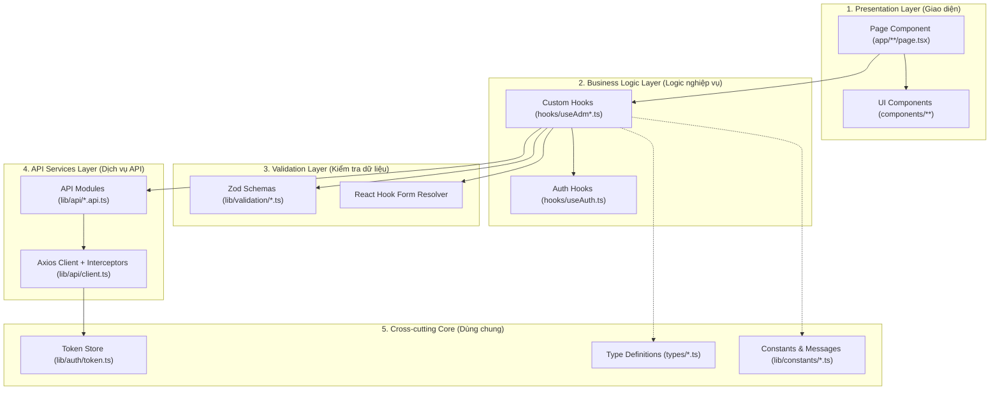
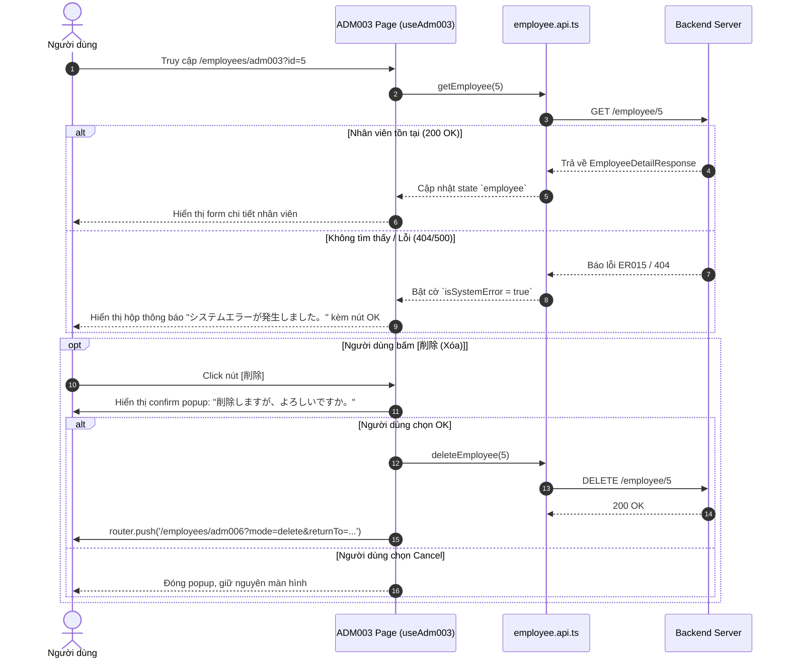
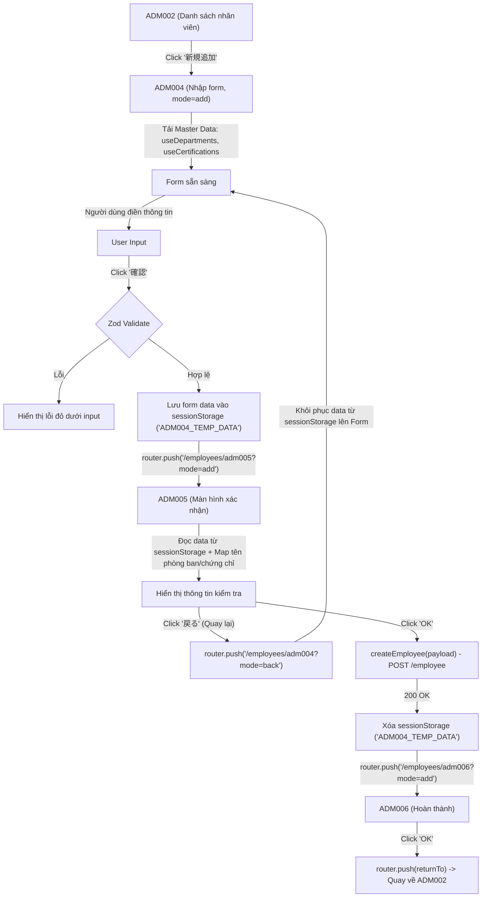
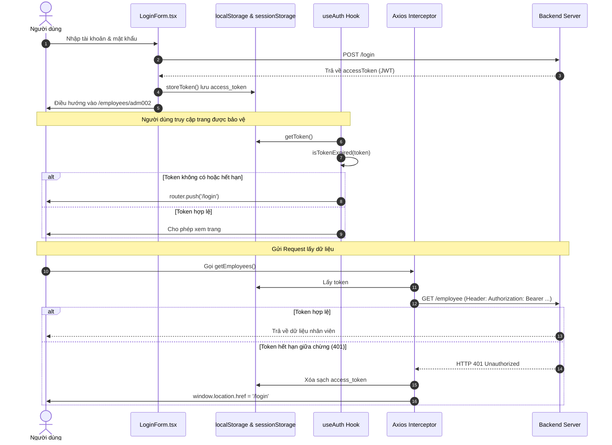

# TÀI LIỆU PHÂN TÍCH TOÀN BỘ KIẾN TRÚC FRONTEND & ONBOARDING DỰ ÁN MANAGE EMPLOYEES

> **Tài liệu học tập, kiến trúc chuyên sâu và cẩm nang đào tạo lập trình viên Frontend (React / Next.js / TypeScript).**  
> *Dựa trên 100% mã nguồn thực tế tại repository `manageEmployees/frontend`.*

---

## MỤC LỤC

1. [Tổng quan dự án](#1-tổng-quan-dự-án)
2. [Tech Stack & Phân tích Dependencies](#2-tech-stack--phân-tích-dependencies)
3. [Cấu trúc thư mục (Folder Structure)](#3-cấu-trúc-thư-mục-folder-structure)
4. [Kiến trúc phân tầng Frontend (Layered Architecture)](#4-kiến-trúc-phân-tầng-frontend-layered-architecture)
5. [Hệ thống Routing & Layout](#5-hệ-thống-routing--layout)
6. [Danh sách màn hình và vai trò trong hệ thống](#6-danh-sách-màn-hình-và-vai-trò-trong-hệ-thống)
7. [Phân tích chi tiết từng màn hình (Screen Deep-dive)](#7-phân-tích-chi-tiết-từng-màn-hình-screen-deep-dive)
   - [7.1 Màn hình Đăng nhập (Login - `/login`)](#71-màn-hình-đăng-nhập-login---login)
   - [7.2 Màn hình Đăng xuất (Logout - `/logout`)](#72-màn-hình-đăng-xuất-logout---logout)
   - [7.3 Màn hình Danh sách nhân viên (ADM002 - `/employees/adm002`)](#73-màn-hình-danh-sách-nhân-viên-adm002---employeesadm002)
   - [7.4 Màn hình Chi tiết nhân viên (ADM003 - `/employees/adm003`)](#74-màn-hình-chi-tiết-nhân-viên-adm003---employeesadm003)
   - [7.5 Màn hình Thêm mới / Chỉnh sửa nhân viên (ADM004 - `/employees/adm004`)](#75-màn-hình-thêm-mới--chỉnh-sửa-nhân-viên-adm004---employeesadm004)
   - [7.6 Màn hình Xác nhận thông tin (ADM005 - `/employees/adm005`)](#76-màn-hình-xác-nhận-thông-tin-adm005---employeesadm005)
   - [7.7 Màn hình Hoàn thành thao tác (ADM006 - `/employees/adm006`)](#77-màn-hình-hoàn-thành-thao-tác-adm006---employeesadm006)
8. [Phân tích luồng nghiệp vụ liên màn hình (Cross-Screen Business Flows)](#8-phân-tích-luồng-nghiệp-vụ-liên-màn-hình-cross-screen-business-flows)
9. [Sơ đồ luồng dữ liệu hai chiều (Data Flow)](#9-sơ-đồ-luồng-dữ-liệu-hai-chiều-data-flow)
10. [Phân tích tầng API & HTTP Client](#10-phân-tích-tầng-api--http-client)
11. [Cơ chế Authentication & Quản lý JWT Token](#11-cơ-chế-authentication--quản-lý-jwt-token)
12. [Cơ chế Quản lý Form (React Hook Form)](#12-cơ-chế-quản-lý-form-react-hook-form)
13. [Phân tích chuyên sâu về Validation (Zod & Custom Refinements)](#13-phân-tích-chuyên-sâu-về-validation-zod--custom-refinements)
14. [Chiến lược Quản lý State (State Management Strategy)](#14-chiến-lược-quản-lý-state-state-management-strategy)
15. [Điều hướng & Cơ chế Bảo lưu trạng thái (Navigation & State Preservation)](#15-điều-hướng--cơ-chế-bảo-lưu-trạng-thái-navigation--state-preservation)
16. [Phân tích chuyên sâu về `useEffect` và Vòng đời Component](#16-phân-tích-chuyên-sâu-về-useeffect-và-vòng-đời-component)
17. [Phân tích TypeScript & Type Safety Layer](#17-phân-tích-typescript--type-safety-layer)
18. [Hệ thống Xử lý lỗi (Error Handling Architecture)](#18-hệ-thống-xử-lý-lỗi-error-handling-architecture)
19. [Quản lý Trạng thái Loading & Trải nghiệm người dùng](#19-quản-lý-trạng-thái-loading--trải-nghiệm-người-dùng)
20. [Thuật toán Tìm kiếm, Sắp xếp đa cột ưu tiên và Phân trang](#20-thuật-toán-tìm-kiếm-sắp-xếp-đa-cột-ưu-tiên-và-phân-trang)
21. [Kiến trúc Giao diện & CSS (Styling Architecture)](#21-kiến-trúc-giao-diện--css-styling-architecture)
22. [Bảng so sánh công nghệ & Phân tích Alternatives](#22-bảng-so-sánh-công-nghệ--phân-tích-alternatives)
23. [Sơ đồ phụ thuộc tập tin (File Dependency Map)](#23-sơ-đồ-phụ-thuộc-tập-tin-file-dependency-map)
24. [Lộ trình kiến thức cần tích lũy từ dự án](#24-lộ-trình-kiến-thức-cần-tích-lũy-từ-dự-án)
25. [Đánh giá kiến trúc: Điểm mạnh & Điểm có thể cải tiến](#25-đánh-giá-kiến-trúc-điểm-mạnh--điểm-có-thể-cải-tiến)
26. [Roadmap hướng dẫn đọc hiểu Source Code cho Developer mới](#26-roadmap-hướng-dẫn-đọc-hiểu-source-code-cho-developer-mới)
27. [Giải đáp 21 câu hỏi cốt lõi về Frontend](#27-giải-đáp-21-câu-hỏi-cốt-lõi-về-frontend)

---

## 1. TỔNG QUAN DỰ ÁN

* **Tên dự án:** Manage Employees (Hệ thống Quản lý Hồ sơ & Trình độ Nhân viên)
* **Loại ứng dụng:** Web Application (Single Page Application xây dựng trên Next.js App Router)
* **Ngôn ngữ & Nền tảng:** TypeScript 5.7+, Next.js 16 (React 19)
* **Mục tiêu nghiệp vụ:**
  - Cho phép người quản trị (Admin) quản lý hồ sơ nhân viên trong công ty.
  - Quản lý các thông tin cá nhân: Họ tên, Tên Katakana, Ngày sinh, Phòng ban (Department), Email, Số điện thoại.
  - Quản lý thông tin trình độ tiếng Nhật (Chứng chỉ, Ngày cấp, Ngày hết hạn, Điểm thi).
  - Cung cấp các thao tác nghiệp vụ: Tìm kiếm, Sắp xếp đa tiêu chí, Phân trang, Xem chi tiết, Thêm mới qua luồng xác nhận (Input -> Confirm -> Complete), Chỉnh sửa, và Xóa nhân viên.
  - Xác thực người dùng bằng cơ chế JSON Web Token (JWT).

---

## 2. TECH STACK & PHÂN TÍCH DEPENDENCIES

Dựa trên file `package.json` thực tế:

```json
{
  "dependencies": {
    "next": "16.0.8",
    "react": "^19.2.3",
    "react-dom": "^19.2.3",
    "axios": "^1.13.2",
    "react-hook-form": "^7.69.0",
    "@hookform/resolvers": "^5.2.2",
    "zod": "^4.2.1",
    "date-fns": "^4.1.0",
    "react-datepicker": "^9.1.0"
  },
  "devDependencies": {
    "typescript": "^5.7.2",
    "eslint": "^9",
    "eslint-config-next": "16.0.8",
    "jest": "^30.2.0",
    "ts-jest": "^29.4.6",
    "@testing-library/react": "^16.3.1",
    "@testing-library/jest-dom": "^6.9.1"
  }
}
```

### Phân tích chi tiết từng công nghệ:

| Thư viện / Công nghệ | Phiên bản | Bản chất | Vai trò trong dự án | Lý do lựa chọn |
| :--- | :--- | :--- | :--- | :--- |
| **Next.js** | `16.0.8` | React Framework hỗ trợ Server/Client Rendering, App Router | Khung xương ứng dụng, định tuyến thư mục (File-system routing), đóng gói build | Tận dụng App Router hiện đại, phân tách layout thông minh, tối ưu routing client-side |
| **React** | `19.2.3` | UI Component Library | Xây dựng giao diện hướng component, quản lý hook lifecycle | Nền tảng hiển thị UI phản ứng (reactive UI) |
| **TypeScript** | `5.7.2` | Static Type Checker | Đảm bảo tính toàn vẹn kiểu dữ liệu khi biên dịch (Compile-time type safety) | Giảm thiểu lỗi runtime `undefined`/`null`, hỗ trợ auto-complete thông minh |
| **Axios** | `1.13.2` | HTTP Client trên nền Promise | Thực hiện các cuộc gọi REST API tới Backend Spring Boot | Hỗ trợ Request/Response Interceptors, tự động serialize JSON, cấu hình BaseURL tập trung |
| **React Hook Form** | `7.69.0` | Form State Management Library | Quản lý state của các input form tại Login (ADM001) và Thêm/Sửa (ADM004) | Hiệu năng cao (Uncontrolled components), giảm thiểu render thừa khi người dùng gõ phím |
| **Zod** | `4.2.1` | TypeScript-first Schema Declaration & Validation | Định nghĩa bộ quy tắc kiểm tra tính hợp lệ dữ liệu (Runtime Validation) | Đồng bộ kiểu dữ liệu TS tự động qua `z.infer`, hỗ trợ custom error message theo mã chuẩn `ER001 - ER023` |
| **@hookform/resolvers**| `5.2.2` | Adapter kết nối Zod và React Hook Form | Cầu nối giữa schema Zod và hàm `handleSubmit` của RHF | Tách biệt hoàn toàn tầng khai báo rule (Zod) khỏi tầng giao diện (RHF) |
| **React Datepicker** | `9.1.0` | Calendar Picker Component | Thành phần chọn ngày tháng trên UI (Ngày sinh, Ngày cấp, Ngày hết hạn chứng chỉ) | Giao diện thân thiện, hỗ trợ dropdown chọn năm/tháng, điều khiển qua keyboard |
| **Date-fns** | `4.1.0` | Thư viện thao tác Date/Time dạng hàm thuần khiết (Pure Functions) | Hỗ trợ tính toán và parse ngày tháng | Nhẹ hơn Moment.js, hỗ trợ tree-shaking tốt |
| **Jest & Testing Library**| `30.x` | Test Runner & React UI Testing Tool | Viết và chạy Unit Test cho Hook, Component, Utility | Đảm bảo chất lượng mã nguồn, kiểm thử tự động các kịch bản |

> **LƯU Ý VỀ STYLING:**  
> Dự án **KHÔNG** sử dụng Tailwind CSS. Toàn bộ style được tổ chức trong `frontend/app/globals.css` (hơn 900 dòng CSS thuần) kết hợp cùng hệ thống layout truyền thống và CSS Grid Table.

---

## 3. CẤU TRÚC THƯ MỤC (FOLDER STRUCTURE)

```text
frontend/
├── app/                              # Next.js App Router (Định tuyến & Trang)
│   ├── (auth)/                       # Route Group: Các trang xác thực
│   │   ├── login/page.tsx            # ADM001: Màn hình Đăng nhập
│   │   └── logout/page.tsx           # Xử lý Đăng xuất & Xóa Token
│   ├── (protected)/                  # Route Group: Các trang nghiệp vụ được bảo vệ
│   │   └── employees/
│   │       ├── adm002/page.tsx       # ADM002: Danh sách nhân viên (Tìm kiếm, Sắp xếp, Phân trang)
│   │       ├── adm003/page.tsx       # ADM003: Chi tiết thông tin nhân viên
│   │       ├── adm004/page.tsx       # ADM004: Thêm mới / Chỉnh sửa nhân viên (Form)
│   │       ├── adm005/page.tsx       # ADM005: Xác nhận thông tin (Confirm)
│   │       └── adm006/page.tsx       # ADM006: Hoàn thành thao tác (Complete)
│   ├── globals.css                   # Toàn bộ CSS dùng chung của hệ thống
│   ├── layout.tsx                    # Root Layout chứa Header, Footer, Container chung
│   └── page.tsx                      # Trang Home mặc định
├── components/                       # Tầng hiển thị (Presentation Layer)
│   ├── auth/
│   │   └── LoginForm.tsx             # Component Form Đăng nhập
│   ├── common/
│   │   └── Pagination.tsx            # Component Phân trang tái sử dụng (Sliding Window)
│   ├── employees/
│   │   ├── EmployeeSearchForm.tsx    # Form tìm kiếm nhân viên (Tên, Phòng ban)
│   │   └── EmployeeTable.tsx         # Bảng hiển thị nhân viên (CSS Grid, Sort Header)
│   └── layout/
│       ├── Header.tsx                # Thanh điều hướng trên cùng (Logo, Logout, Top)
│       └── Footer.tsx                # Chân trang bản quyền
├── hooks/                            # Tầng Business Logic (Custom Hooks)
│   ├── useAdm002.ts                  # Logic màn hình ADM002 (Search, Multi-sort, Pagination, URL Sync)
│   ├── useAdm003.ts                  # Logic màn hình ADM003 (Fetch Detail, Delete Confirm, Back)
│   ├── useAdm004.ts                  # Logic màn hình ADM004 (Form Add/Edit, Tab Trap, Auto Focus)
│   ├── useAdm005.ts                  # Logic màn hình ADM005 (Submit API, Session Restore, Delete API)
│   ├── useAuth.ts                    # Hook bảo vệ Route (`useAuth` và `useGuest`)
│   ├── useCertifications.ts          # Hook tải Master Data danh sách chứng chỉ tiếng Nhật
│   ├── useDepartments.ts             # Hook tải Master Data danh sách phòng ban
│   └── useEmployees.ts               # Alias re-export từ `useAdm002`
├── lib/                              # Tầng Core Utilities, Config & Client
│   ├── api/                          # Tầng gọi API qua HTTP
│   │   ├── client.ts                 # Cấu hình Axios Client & Interceptors (Request/Response)
│   │   ├── employee.api.ts           # Các API CRUD nhân viên (get, create, update, delete, check-exist)
│   │   ├── department.api.ts         # API lấy danh sách phòng ban (/department)
│   │   └── certification.api.ts      # API lấy danh sách chứng chỉ (/certifications)
│   ├── auth/
│   │   └── token.ts                  # Quản lý lưu trữ/kiểm tra JWT (localStorage/sessionStorage, parse JWT)
│   ├── constants/
│   │   ├── index.ts                  # Cấu hình hằng số (PAGING, SORT_ORDER, ROUTES, QUERY_PARAMS)
│   │   └── messages.ts               # Bộ thông báo chuẩn Nhật ngữ (ER001-ER023, MSG001-MSG005, FIELD_LABELS)
│   ├── utils/
│   │   ├── format.ts                 # Xử lý format văn bản (truncateText cắt 22 ký tự)
│   │   └── messageHelper.ts          # Trình biên dịch thông báo lỗi có tham số động
│   └── validation/                   # Tầng Schema Validation
│       ├── auth.ts                   # Schema xác thực đăng nhập (loginSchema)
│       └── employee.ts               # Schema nhân viên (base, add, edit, date validation)
├── types/                            # Tầng Định nghĩa Kiểu dữ liệu TypeScript
│   ├── api.ts                        # Kiểu dữ liệu phản hồi API chung, ApiError, Pagination
│   ├── auth.ts                       # Kiểu dữ liệu đăng nhập, Token payload
│   ├── certification.ts              # Kiểu dữ liệu Master Data chứng chỉ
│   ├── department.ts                 # Kiểu dữ liệu Master Data phòng ban
│   └── employee.ts                   # Kiểu dữ liệu Nhân viên, Request/Response DTO, Sort Orders
├── tests/                            # Thư mục kiểm thử tự động (Jest + RTL)
├── proxy.ts                          # Bộ xử lý NextRequest/NextResponse (Edge Route proxy)
├── package.json                      # Danh sách dependencies và scripts
└── tsconfig.json                     # Cấu hình TypeScript Compiler
```

---

## 4. KIẾN TRÚC PHÂN TẦNG FRONTEND (LAYERED ARCHITECTURE)

Dự án được thiết kế theo mô hình **Separation of Concerns (Phân tách mối quan tâm)** rất rõ ràng và mạch lạc:



### Chi tiết nhiệm vụ từng tầng:

1. **Presentation Layer (`app/`, `components/`):**
   - Chỉ chịu trách nhiệm render HTML, áp dụng CSS class và bắt các sự kiện người dùng (Click, Change, KeyDown).
   - Tuyệt đối không viết trực tiếp `axios.get()` hay xử lý thuật toán phức tạp tại đây. Tất cả đều gọi qua Custom Hook.
2. **Business Logic Layer (`hooks/`):**
   - Đóng gói toàn bộ state (`useState`), vòng đời (`useEffect`), các hàm xử lý sự kiện (`handleSearch`, `handleSort`, `handleConfirm`).
   - Đóng vai trò là "Controller" kết nối UI với API và Validation.
3. **Validation Layer (`lib/validation/`):**
   - Định nghĩa quy tắc hợp lệ của dữ liệu bằng Zod (Regex Katakana, Kiểm tra định dạng ngày, Kiểm tra ngày kết thúc >= ngày bắt đầu, v.v.).
4. **API Services Layer (`lib/api/`):**
   - Đóng gói các endpoint RESTful, chuyển đổi tham số từ frontend thành query params hoặc request body chuẩn cho Backend.
5. **Axios Client & Interceptors (`lib/api/client.ts`):**
   - Điểm duy nhất thực thi cuộc gọi HTTP qua mạng. Tự động đính kèm Token `Bearer` vào header và bắt lỗi `401 Unauthorized` để redirect về màn hình Login.

---

## 5. HỆ THỐNG ROUTING & LAYOUT

### 5.1 Cấu trúc Định tuyến trong Next.js App Router

* Dự án sử dụng **Route Groups** (thư mục có dấu ngoặc đơn `(...)`) để nhóm các trang có cùng ngữ cảnh bảo mật mà **không làm thay đổi URL hiển thị**:
  - `(auth)`: Chứa `/login`, `/logout` (Không yêu cầu đăng nhập trước).
  - `(protected)`: Chứa `/employees/adm002`, `adm003`, `adm004`, `adm005`, `adm006` (Bắt buộc phải có JWT Token).

### 5.2 Cơ chế Root Layout (`app/layout.tsx`)

Mã nguồn thực tế trong `app/layout.tsx`:

```tsx
'use client'
import './globals.css';
import Header from '../components/layout/Header';
import Footer from '../components/layout/Footer';
import { usePathname } from 'next/navigation';

export default function RootLayout({ children }: { children: React.ReactNode }) {
  const pathname = usePathname();
  const showHeaderFooter = !pathname.includes('/login');
  
  return (
    <html lang="ja">
      <body>
        {showHeaderFooter ? (
          <main>
            <div className="container">
              <Header />
              <div className="content">
                <div className="content-main">
                  {children}
                </div>
              </div>
              <Footer />
            </div>
          </main>
        ) : (
          children
        )}
      </body>
    </html>
  );
}
```

* **[PROJECT] Phân tích thiết kế:**
  - File sử dụng chỉ thị `'use client'` vì cần gọi hook `usePathname()` để đọc route hiện tại.
  - **Dynamic Layout:** Nếu người dùng đang ở trang `/login`, biến `showHeaderFooter` là `false`, trang render giao diện toàn màn hình không có Header/Footer. Ngược lại, tất cả các màn hình nghiệp vụ nhân viên sẽ được bọc tự động bởi `<Header />`, khung thẻ `<div className="content-main">`, và `<Footer />`.

---

## 6. DANH SÁCH MÀN HÌNH VÀ VAI TRÒ TRONG HỆ THỐNG

| Mã màn hình | Tên màn hình | Đường dẫn URL | Mục đích nghiệp vụ |
| :--- | :--- | :--- | :--- |
| **ADM001** | Đăng nhập (Login) | `/login` | Xác thực tài khoản người quản trị, nhận và lưu trữ JWT token |
| **LOGOUT** | Đăng xuất (Logout) | `/logout` | Xóa sạch Access Token trong Storage và chuyển hướng về Login |
| **ADM002** | Danh sách nhân viên (List) | `/employees/adm002` | Tra cứu, lọc theo phòng ban, sắp xếp đa cột ưu tiên, phân trang |
| **ADM003** | Chi tiết nhân viên (Detail) | `/employees/adm003` | Xem toàn bộ thông tin chi tiết, liên kết sang sửa hoặc xóa |
| **ADM004** | Nhập liệu Thêm / Sửa (Form) | `/employees/adm004` | Nhập và validate thông tin cá nhân & chứng chỉ tiếng Nhật |
| **ADM005** | Xác nhận thông tin (Confirm) | `/employees/adm005` | Xem lại thông tin trước khi commit xuống cơ sở dữ liệu |
| **ADM006** | Hoàn thành thao tác (Complete) | `/employees/adm006` | Hiển thị thông báo thành công sau khi Thêm, Sửa hoặc Xóa |

---

## 7. PHÂN TÍCH CHI TIẾT TỪNG MÀN HÌNH (SCREEN DEEP-DIVE)

---

### 7.1 Màn hình Đăng nhập (Login - `/login`)

#### 1. Mục đích
Cho phép người dùng quản trị đăng nhập vào hệ thống bằng tên đăng nhập và mật khẩu. Đây là cổng vào duy nhất của toàn bộ chức năng quản lý.

#### 2. Route & Cơ chế hoạt động
* **URL:** `/login`
* **File:** `app/(auth)/login/page.tsx`
* **Cơ chế Route Guard:** Sử dụng hook `useGuest()`: Nếu người dùng đã có token hợp lệ trong Storage, hệ thống sẽ tự động chuyển hướng người dùng thẳng vào `/employees/adm002` mà không cần đăng nhập lại.

#### 3. Các file liên quan
* [page.tsx](file:///d:/Project/manageEmployees/frontend/app/(auth)/login/page.tsx): Entry point của trang, áp dụng `useGuest()`.
* [LoginForm.tsx](file:///d:/Project/manageEmployees/frontend/components/auth/LoginForm.tsx): Component chứa form đăng nhập, tích hợp React Hook Form + Zod.
* [auth.ts (validation)](file:///d:/Project/manageEmployees/frontend/lib/validation/auth.ts): Khai báo `loginSchema`.
* [token.ts](file:///d:/Project/manageEmployees/frontend/lib/auth/token.ts): Hàm `storeToken` ghi token vào cả `localStorage` và `sessionStorage`.
* [client.ts](file:///d:/Project/manageEmployees/frontend/lib/api/client.ts): Gọi trực tiếp `apiClient.post('/login', data)`.

#### 4. Component Tree
```text
LoginPage (app/(auth)/login/page.tsx)
└── div.limiter > div.container-login100 > div.wrap-login100
    ├── div.login100-pic (Logo/Image)
    └── LoginForm (components/auth/LoginForm.tsx)
        ├── Error Banner (errors.root)
        ├── Input Username (with validation error)
        ├── Input Password (with validation error)
        └── Button Submit ("ログイン")
```

#### 5. State & Dữ liệu
* `username`: Quản lý bởi React Hook Form (bắt buộc nhập).
* `password`: Quản lý bởi React Hook Form (bắt buộc nhập).
* `errors.root`: Quản lý thông báo lỗi đăng nhập thất bại từ server (ví dụ: Sai tài khoản/mật khẩu).

#### 6. User Interaction & Code Flow
```text
Người dùng nhập Username & Password -> Bấm [ログイン]
    ↓
RHF kích hoạt handleSubmit(onSubmit)
    ↓
Zod validate qua zodResolver(loginSchema)
    ├── Nếu không hợp lệ -> Hiển thị lỗi đỏ dưới input tương ứng
    └── Nếu hợp lệ -> Gọi hàm onSubmit(data)
           ↓
apiClient.post('/login', data) -> Gửi HTTP POST tới Backend
    ↓
Backend xác thực:
    ├── THÀNH CÔNG (200): Trả về { accessToken, tokenType }
    │      ↓
    │   storeToken(accessToken, tokenType) -> Lưu vào Local/Session Storage
    │      ↓
    │   router.push('/employees/adm002') -> Chuyển hướng sang màn hình danh sách
    └── THẤT BẠI (400/401/500):
           ↓
        setError('root', { message: 'ログインに失敗しました...' }) -> Báo lỗi trên UI
```

---

### 7.2 Màn hình Đăng xuất (Logout - `/logout`)

#### 1. Mục đích
Thu hồi phiên làm việc của người dùng hiện tại, xóa thông tin xác thực trên trình duyệt và điều hướng về trang Login.

#### 2. Route & Mã nguồn
* **URL:** `/logout`
* **File:** [page.tsx](file:///d:/Project/manageEmployees/frontend/app/(auth)/logout/page.tsx)

```tsx
'use client';
import { useEffect } from 'react';
import { useRouter } from 'next/navigation';
import { removeToken } from '@/lib/auth/token';

export default function LogoutPage() {
  const router = useRouter();
  useEffect(() => {
    removeToken();
    router.push('/login');
  }, [router]);

  return <div>Logging out...</div>;
}
```

* **[CONCEPT] Tại sao làm màn hình Logout riêng thay vì chỉ là một nút bấm?**  
  Việc có route `/logout` giúp các liên kết như `<Link href="/logout">` trên Header hoạt động tự nhiên theo chuẩn web, dễ dàng chia sẻ hoặc redirect khi token hết hạn từ bất kỳ đâu.

---

### 7.3 Màn hình Danh sách nhân viên (ADM002 - `/employees/adm002`)

#### 1. Mục đích
* Cho phép tìm kiếm nhân viên theo tên hoặc theo phòng ban.
* Hiển thị bảng dữ liệu nhân viên gồm 9 cột: `ID`, `氏名` (Họ tên), `生年月日` (Ngày sinh), `グループ` (Phòng ban), `メールアドレス` (Email), `電話番号` (SĐT), `日本語能力` (Chứng chỉ tiếng Nhật), `失効日` (Ngày hết hạn), `点数` (Điểm số).
* Cung cấp cơ chế **sắp xếp đa cột có ưu tiên (Priority Multi-column Sorting)**.
* Cung cấp thanh phân trang linh hoạt (Sliding Window Pagination).

#### 2. Route & Cơ chế hoạt động
* **URL:** `/employees/adm002`
* **Bảo vệ:** Được bảo vệ bởi hook `useAuth()`.
* **Cơ chế Đồng bộ URL:** Mọi trạng thái lọc (`employee_name`, `department_id`), phân trang (`offset`), và sắp xếp (`ord_employee_name`, `ord_certification_name`, `ord_end_date`) đều được đồng bộ hai chiều lên URL Search Params.

#### 3. Các file liên quan
* [page.tsx](file:///d:/Project/manageEmployees/frontend/app/(protected)/employees/adm002/page.tsx): Khung chứa Suspense, gọi `useAdm002()`.
* [useAdm002.ts](file:///d:/Project/manageEmployees/frontend/hooks/useAdm002.ts): Custom Hook cốt lõi quản lý toàn bộ nghiệp vụ ADM002.
* [EmployeeSearchForm.tsx](file:///d:/Project/manageEmployees/frontend/components/employees/EmployeeSearchForm.tsx): Form nhập tiêu chí tìm kiếm.
* [EmployeeTable.tsx](file:///d:/Project/manageEmployees/frontend/components/employees/EmployeeTable.tsx): Render bảng dữ liệu bằng CSS Grid.
* [Pagination.tsx](file:///d:/Project/manageEmployees/frontend/components/common/Pagination.tsx): Component phân trang tái sử dụng.
* [employee.api.ts](file:///d:/Project/manageEmployees/frontend/lib/api/employee.api.ts): Hàm `getEmployees(params)`.
* [department.api.ts](file:///d:/Project/manageEmployees/frontend/lib/api/department.api.ts): Hàm `getDepartments()`.

#### 4. Component Tree
```text
EmployeeListPage (app/(protected)/employees/adm002/page.tsx)
└── Suspense (fallback: LOADING)
    └── EmployeeListContent
        ├── Error Box (errorMessage nếu có)
        ├── EmployeeSearchForm (components/employees/EmployeeSearchForm.tsx)
        │   ├── Input Tên nhân viên (氏名)
        │   ├── Select Phòng ban (グループ)
        │   └── Btn Group: [検索 (Search)] & [新規追加 (Add New)]
        └── EmployeeTable (components/employees/EmployeeTable.tsx)
            ├── Header CSS Grid (Clickable sortable columns)
            ├── Body CSS Grid (List of Employee rows)
            └── Pagination (components/common/Pagination.tsx)
```

#### 5. Bảng phân tích State trong `useAdm002`

| Tên State | Kiểu dữ liệu | Ai tạo ra / Quản lý | Khi nào thay đổi? | Tác động lên UI |
| :--- | :--- | :--- | :--- | :--- |
| `employees` | `EmployeeItem[]` | `useState` trong `useAdm002` | Khi API `getEmployees` trả về kết quả | Render lại danh sách dòng trong bảng |
| `departments` | `DepartmentItem[]` | `useState` trong `useAdm002` | Khi API `getDepartments` nạp xong lúc mount | Điền options vào dropdown phòng ban |
| `loading` | `boolean` | `useState` trong `useAdm002` | Bắt đầu/Kết thúc gọi API tìm kiếm | Hiển thị thông báo "データを読み込み中..." |
| `errorMessage` | `string` | `useState` trong `useAdm002` | Khi API trả về lỗi hoặc mạng đứt | Hiển thị khung `.box-err` màu đỏ |
| `employeeName` | `string` | `useState` (khởi tạo từ URL) | Khi người dùng gõ vào ô tìm kiếm tên | Cập nhật giá trị ô input |
| `departmentId` | `string` | `useState` (khởi tạo từ URL) | Khi người dùng chọn option phòng ban | Cập nhật dropdown chọn |
| `sortOrders` | `SortOrders` | `useState` (khởi tạo từ URL) | Khi người dùng click vào header cột | Đổi icon `▲▽` / `△▼` trên bảng |
| `sortPriority`| `SortField[]` | `useState` (khởi tạo từ URL) | Khi click vào một cột -> cột đó lên đầu priority | Thứ tự param truyền lên API và URL |
| `currentPage` | `number` | `useState` (tính từ offset) | Khi người dùng click chọn số trang hoặc Next/Pre | Active số trang trên Pagination |
| `totalRecords`| `number` | `useState` | Khi API trả về `totalRecords` | Tính toán `totalPages` cho Pagination |

---

### 7.4 Màn hình Chi tiết nhân viên (ADM003 - `/employees/adm003`)

#### 1. Mục đích
Hiển thị toàn bộ thông tin chi tiết của một nhân viên cụ thể dựa trên `id` truyền trên URL. Cung cấp các nút điều hướng: Chỉnh sửa (編集), Xóa (削除), Quay lại (戻る).

#### 2. Route & Parameters
* **URL:** `/employees/adm003?id={employeeId}&returnTo={returnUrl}`
* **Query Params:**
  - `id`: Mã định danh nhân viên cần xem.
  - `returnTo`: URL lưu giữ toàn bộ điều kiện tìm kiếm/phân trang/sắp xếp của màn hình ADM002 trước đó.

#### 3. Các file liên quan
* [page.tsx](file:///d:/Project/manageEmployees/frontend/app/(protected)/employees/adm003/page.tsx): Render giao diện xem chi tiết hoặc hiển thị thông báo "Lỗi hệ thống" (System Error Box) nếu nhân viên không tồn tại.
* [useAdm003.ts](file:///d:/Project/manageEmployees/frontend/hooks/useAdm003.ts): Xử lý fetch chi tiết nhân viên và gọi API xóa trực tiếp kèm popup xác nhận `window.confirm`.
* [employee.api.ts](file:///d:/Project/manageEmployees/frontend/lib/api/employee.api.ts): Hàm `getEmployee(id)` và `deleteEmployee(id)`.

#### 4. User Interaction & Code Flow



---

### 7.5 Màn hình Thêm mới / Chỉnh sửa nhân viên (ADM004 - `/employees/adm004`)

#### 1. Mục đích
* Là form nhập liệu chính của hệ thống, phục vụ cả 2 nghiệp vụ: **Thêm mới** (`mode=add`) và **Chỉnh sửa** (`mode=edit`).
* Tự động điều chỉnh quy tắc validate: Mode Add thì Mật khẩu là bắt buộc; Mode Edit thì Mật khẩu là tùy chọn (chỉ validate khi người dùng nhập).
* Kiểm soát tính hợp lệ chặt chẽ: Tên Katakana, Định dạng email, Số điện thoại, Ngày sinh, Ngày cấp/hết hạn chứng chỉ tiếng Nhật.
* Hỗ trợ tính năng UX nâng cao: **Tab Focus Loop (Vòng lặp phím Tab)** và **Auto Focus vào input đầu tiên**.

#### 2. Route & Parameters
* **URL:**
  - Thêm mới: `/employees/adm004?mode=add&returnTo=...`
  - Chỉnh sửa: `/employees/adm004?mode=edit&id=5&returnTo=...`
  - Quay lại từ ADM005: `/employees/adm004?mode=back&returnTo=...`

#### 3. Các file liên quan
* [page.tsx](file:///d:/Project/manageEmployees/frontend/app/(protected)/employees/adm004/page.tsx): Giao diện form nhập liệu, tích hợp DatePicker qua `Controller` của React Hook Form.
* [useAdm004.ts](file:///d:/Project/manageEmployees/frontend/hooks/useAdm004.ts): Hook quản lý trạng thái form, khôi phục dữ liệu từ `sessionStorage`, kiểm tra nhân viên tồn tại trước khi confirm bằng `checkEmployeeExist()`.
* [employee.ts (validation)](file:///d:/Project/manageEmployees/frontend/lib/validation/employee.ts): Định nghĩa `addEmployeeSchema`, `editEmployeeSchema`.
* [useDepartments.ts](file:///d:/Project/manageEmployees/frontend/hooks/useDepartments.ts): Lấy danh sách phòng ban cho Select box.
* [useCertifications.ts](file:///d:/Project/manageEmployees/frontend/hooks/useCertifications.ts): Lấy danh sách chứng chỉ tiếng Nhật.

#### 4. Logic đồng bộ dữ liệu chứng chỉ tiếng Nhật (Dynamic Validation Clearing)
Mã nguồn thực tế trong `useAdm004.ts`:

```typescript
const selectedCertId = watch('certificationId');
const isCertificationSelected = Boolean(
  selectedCertId && selectedCertId !== '' && selectedCertId !== '0'
);

// Tự động clear dữ liệu & lỗi của 3 trường chứng chỉ khi người dùng chọn "Không có chứng chỉ"
useEffect(() => {
  if (!isCertificationSelected) {
    setValue('certificationStartDate', '');
    setValue('certificationEndDate', '');
    setValue('employeeCertificationScore', '');
    clearErrors([
      'certificationStartDate',
      'certificationEndDate',
      'employeeCertificationScore',
    ]);
  }
}, [isCertificationSelected, setValue, clearErrors]);
```

* **[PROJECT] Ý nghĩa:** Khi người dùng chuyển dropdown Chứng chỉ về trạng thái rỗng ("選択してください"), hook sẽ tự động xóa sạch dữ liệu ngày cấp, ngày hết hạn, điểm số và vô hiệu hóa/xóa các thông báo lỗi liên quan đến khối chứng chỉ.

---

### 7.6 Màn hình Xác nhận thông tin (ADM005 - `/employees/adm005`)

#### 1. Mục đích
* Cho phép người dùng kiểm tra lại toàn bộ dữ liệu đã nhập ở ADM004 trước khi thực sự gửi lệnh `POST` hoặc `PUT` xuống cơ sở dữ liệu.
* Trong trường hợp người dùng xóa nhân viên từ luồng xác nhận, ADM005 cũng có thể đóng vai trò màn hình xác nhận xóa (`mode=delete`).

#### 2. Route & Cơ chế lưu trữ
* **URL:** `/employees/adm005?mode={add|edit|delete}&id={id}&returnTo={returnTo}`
* **Nguồn dữ liệu:**
  - Nếu `mode=add` hoặc `mode=edit`: Đọc dữ liệu từ `sessionStorage.getItem('ADM004_TEMP_DATA')`.
  - Nếu `mode=delete`: Gọi trực tiếp API `getEmployee(id)` để lấy thông tin nhân viên hiển thị.

#### 3. Các file liên quan
* [page.tsx](file:///d:/Project/manageEmployees/frontend/app/(protected)/employees/adm005/page.tsx): Render thông tin dạng bảng phẳng chỉ đọc (Read-only view).
* [useAdm005.ts](file:///d:/Project/manageEmployees/frontend/hooks/useAdm005.ts): Thực thi API `createEmployee`, `updateEmployee`, `deleteEmployee` khi người dùng bấm [OK].
* [useDepartments.ts](file:///d:/Project/manageEmployees/frontend/hooks/useDepartments.ts) & [useCertifications.ts](file:///d:/Project/manageEmployees/frontend/hooks/useCertifications.ts): Dùng để ánh xạ (map) từ `departmentId` sang `departmentName` và `certificationId` sang `certificationName`.

#### 4. Luồng xử lý khi bấm [OK] và [Quay lại]
```text
Bấm [OK]:
  ├── mode === 'add':
  │     createEmployee(payload) -> 200 OK -> Xóa sessionStorage -> Điều hướng /employees/adm006?mode=add
  ├── mode === 'edit':
  │     updateEmployee(id, payload) -> 200 OK -> Xóa sessionStorage -> Điều hướng /employees/adm006?mode=edit
  └── mode === 'delete':
        deleteEmployee(id) -> 200 OK -> Điều hướng /employees/adm006?mode=delete

Bấm [戻る (Quay lại)]:
  ├── mode === 'add' -> Điều hướng về /employees/adm004?mode=back (Khôi phục dữ liệu từ sessionStorage)
  ├── mode === 'edit' -> Điều hướng về /employees/adm004?mode=back&id=...
  └── mode === 'delete' -> Điều hướng về /employees/adm003?id=... (Trang chi tiết)
```

---

### 7.7 Màn hình Hoàn thành thao tác (ADM006 - `/employees/adm006`)

#### 1. Mục đích
Hiển thị thông điệp xác nhận thao tác nghiệp vụ đã được thực hiện thành công vào cơ sở dữ liệu.

#### 2. Route & Mapping thông báo
* **URL:** `/employees/adm006?mode={add|edit|delete}&returnTo={returnTo}`
* **Bảng thông báo hiển thị:**
  - `mode=add`: `ユーザの登録が完了しました。` (MSG001)
  - `mode=edit`: `ユーザの更新が完了しました。` (MSG002)
  - `mode=delete`: `ユーザの削除が完了しました。` (MSG003)
* **Thao tác người dùng:** Nhấn nút `[OK]` -> Hệ thống gọi `router.push(returnTo)` để đưa người dùng trở lại danh sách nhân viên ADM002 với nguyên vẹn các điều kiện tìm kiếm ban đầu.

---

## 8. PHÂN TÍCH LUỒNG NGHIỆP VỤ LIÊN MÀN HÌNH (CROSS-SCREEN BUSINESS FLOWS)

### 8.1 Luồng Thêm mới nhân viên (Add Employee Flow)



### 8.2 Luồng Chỉnh sửa nhân viên (Edit Employee Flow)

1. Từ **ADM002**, người dùng bấm vào ID nhân viên -> Chuyển đến **ADM003** (`/employees/adm003?id=10`).
2. Tại **ADM003**, người dùng bấm `[編集]` -> Chuyển sang **ADM004** (`/employees/adm004?mode=edit&id=10`).
3. **ADM004** kích hoạt `useEffect`:
   - Gọi `getEmployee(10)` từ API.
   - Map dữ liệu từ API sang cấu trúc form và điền vào `reset(editFormData)`.
4. Người dùng sửa thông tin và bấm `[確認]`:
   - Form validate bằng `editEmployeeSchema` (Mật khẩu không bắt buộc).
   - Hook gọi API `checkEmployeeExist(10)` để đảm bảo nhân viên chưa bị xóa bởi user khác.
   - Lưu dữ liệu vào `sessionStorage` và chuyển sang **ADM005** (`/employees/adm005?mode=edit&id=10`).
5. Tại **ADM005**, người dùng bấm `[OK]`:
   - Gọi API `updateEmployee(10, payload)` (Method: `PUT /employee/10`).
   - Xóa `sessionStorage` và chuyển sang **ADM006** (`/employees/adm006?mode=edit`).
6. Tại **ADM006**, bấm `[OK]` -> Quay về danh sách **ADM002** tại đúng trang và điều kiện tìm kiếm cũ.

---

## 9. SƠ ĐỒ LUỒNG DỮ LIỆU HAI CHIỀU (DATA FLOW)

### Chiều 1: Nhận dữ liệu từ Backend hiển thị lên Giao diện (Fetch Flow)

```text
Backend Database
      ↓ (JSON Response)
Spring Boot REST API (/employee, /department, ...)
      ↓ (HTTP 200 OK)
Axios Client (lib/api/client.ts) [Tự động parse JSON]
      ↓ (Promise<Response>)
API Service Function (lib/api/*.api.ts) [Typed Response DTO]
      ↓ (Data Object)
Custom Hook (hooks/useAdm*.ts) [setEmployees(), setDepartments()]
      ↓ (State Update)
React Component Re-render (app/**/page.tsx, components/**)
      ↓ (Virtual DOM Diffing)
Browser DOM Paint (Hiển thị bảng dữ liệu, options dropdown)
```

### Chiều 2: Người dùng thao tác gửi dữ liệu xuống Backend (Submit Flow)

```text
Người dùng tương tác trên UI (Gõ phím, Click nút Confirm)
      ↓ (Synthetic Event)
React Hook Form Controller / Register (Ghi nhận input state)
      ↓ (Trigger Validate)
Zod Schema Resolver (Kiểm tra Regex, Độ dài, Format ngày)
      ↓ (Nếu Hợp lệ)
Hook Event Handler (handleConfirm / handleOk)
      ↓ (Construct Payload Object)
API Service Function (createEmployee / updateEmployee)
      ↓ (Axios Request)
Axios Request Interceptor (Tự động gắn header: Authorization: Bearer <token>)
      ↓ (HTTP POST/PUT)
Backend Spring Boot API -> Controller -> Service -> Database Save
```

---

## 10. PHÂN TÍCH TẦNG API & HTTP CLIENT

### 10.1 Bảng danh mục toàn bộ API được Frontend sử dụng

| Endpoint API | HTTP Method | Mục đích | File gọi API | Request Body / Params | Response Data Type | Màn hình sử dụng |
| :--- | :---: | :--- | :--- | :--- | :--- | :--- |
| `/login` | `POST` | Xác thực đăng nhập, cấp JWT Token | `LoginForm.tsx` | `{ username, password }` | `{ accessToken, tokenType }` | Login |
| `/department` | `GET` | Lấy danh mục tất cả phòng ban | `department.api.ts` | Không | `DepartmentListApiResponse` | ADM002, ADM004, ADM005 |
| `/certifications` | `GET` | Lấy danh mục chứng chỉ tiếng Nhật | `certification.api.ts` | Không | `CertificationListApiResponse` | ADM004, ADM005 |
| `/employee` | `GET` | Tìm kiếm, lọc, sắp xếp & phân trang | `employee.api.ts` | Query params: `employee_name`, `department_id`, `ord_*`, `offset`, `limit` | `EmployeeListApiResponse` | ADM002 |
| `/employee` | `POST` | Thêm mới nhân viên và chứng chỉ | `employee.api.ts` | `EmployeeCreateRequest` payload | `ApiResponse` | ADM005 |
| `/employee/{id}` | `GET` | Lấy chi tiết thông tin nhân viên | `employee.api.ts` | Path param: `id` | `EmployeeDetailResponse` | ADM003, ADM004, ADM005 |
| `/employee/{id}` | `PUT` | Cập nhật thông tin nhân viên | `employee.api.ts` | Path param: `id`, Body: `EmployeeUpdateRequest` | `ApiResponse` | ADM005 |
| `/employee/{id}` | `DELETE` | Xóa nhân viên khỏi hệ thống | `employee.api.ts` | Path param: `id` | `ApiResponse` | ADM003, ADM005 |
| `/employee/{id}/check-exist` | `GET` | Kiểm tra nhân viên còn tồn tại không | `employee.api.ts` | Path param: `id` | `ApiResponse` (200 nếu tồn tại) | ADM004 |

### 10.2 Phân tích Axios Client & Interceptor Architecture (`lib/api/client.ts`)

Mã nguồn thực tế trong `lib/api/client.ts`:

```typescript
import axios from 'axios';

const API_BASE_URL = process.env.NEXT_PUBLIC_API_URL || 'http://localhost:8085';

const apiClient = axios.create({
  baseURL: API_BASE_URL,
  headers: {
    'Content-Type': 'application/json',
  },
});

export function setupInterceptors(client: ReturnType<typeof axios.create>) {
  // 1. Request Interceptor: Tự động đính kèm Token vào mọi request
  client.interceptors.request.use(
    (config) => {
      const token = typeof window !== 'undefined'
        ? (localStorage.getItem('access_token') || sessionStorage.getItem('access_token'))
        : null;
      if (token && config.headers) {
        config.headers.Authorization = `Bearer ${token}`;
      }
      return config;
    },
    (error) => Promise.reject(error)
  );

  // 2. Response Interceptor: Tự động bắt mã 401 để xử lý hết hạn phiên
  client.interceptors.response.use(
    (response) => response,
    (error) => {
      if (error.response?.status === 401) {
        if (typeof window !== 'undefined') {
          localStorage.removeItem('access_token');
          localStorage.removeItem('token_type');
          sessionStorage.removeItem('access_token');
          sessionStorage.removeItem('token_type');
          window.location.href = '/login';
        }
      }
      return Promise.reject(error);
    }
  );
}

setupInterceptors(apiClient);
export { apiClient };
```

#### [CONCEPT] Tại sao phải tạo wrapper `apiClient` thay vì gọi trực tiếp `axios.get()` ở component?
1. **DRY (Don't Repeat Yourself):** Không phải lặp lại logic cấu hình `baseURL`, `headers`, và đính kèm `Authorization: Bearer <token>` ở hàng chục file khác nhau.
2. **Centralized Error Handling:** Bắt tập trung mã lỗi `401 Unauthorized`. Khi token hết hạn hoặc không hợp lệ, ứng dụng tự động xóa token và chuyển người dùng về trang login ngay lập tức mà không làm crash component.
3. **Môi trường linh hoạt:** Chỉ cần đổi biến môi trường `NEXT_PUBLIC_API_URL` là toàn bộ ứng dụng chuyển đổi giữa Development, Staging và Production mà không cần sửa code.

---

## 11. CƠ CHẾ AUTHENTICATION & QUẢN LÝ JWT TOKEN

### 11.1 Vòng đời của JWT Token trên Frontend



### 11.2 Giải mã JWT Client-side (`lib/auth/token.ts`)

Hàm `isTokenExpired` trong `lib/auth/token.ts` kiểm tra hạn dùng của token trực tiếp trên trình duyệt mà không cần gửi request lên backend:

```typescript
export function isTokenExpired(token: string): boolean {
  try {
    if (!token) return true;
    const parts = token.split('.');
    if (parts.length < 2) return true;

    // Chuyển Base64URL sang chuẩn Base64
    let base64 = parts[1].replace(/-/g, '+').replace(/_/g, '/');
    while (base64.length % 4) {
      base64 += '=';
    }

    const decoded = atob(base64);
    const payload = JSON.parse(decoded);
    if (!payload.exp) return false;
    // So sánh thời gian hết hạn (exp tính bằng giây) với Date.now() (mili-giây)
    return Date.now() >= payload.exp * 1000;
  } catch {
    return true;
  }
}
```

* **[CONCEPT] Tại sao dùng cả `localStorage` và `sessionStorage`?**  
  Mã nguồn lưu đồng thời vào cả 2 storage để đảm bảo tính sẵn sàng cao nhất khi người dùng mở nhiều tab (`localStorage`) hoặc làm việc trong một phiên duy nhất (`sessionStorage`).

---

## 12. CƠ CHẾ QUẢN LÝ FORM (REACT HOOK FORM)

### 12.1 Tại sao dự án sử dụng React Hook Form thay vì `useState` cho từng input?

* **Vấn đề của `useState` truyền thống:** Mỗi lần người dùng gõ 1 ký tự vào input, state thay đổi -> toàn bộ component cha và tất cả input con bị re-render lại -> gây giật lag (re-render storm) trên các form lớn có nhiều trường như ADM004 (13 trường dữ liệu).
* **Giải pháp của React Hook Form:** Sử dụng cơ chế **Uncontrolled Component** dựa trên `ref`. Dữ liệu được lưu trữ trực tiếp trong DOM của trình duyệt, chỉ re-render những thành phần thực sự cần thiết (như hiển thị message lỗi), giúp tăng hiệu năng UI tối đa.

### 12.2 Các API cốt lõi của React Hook Form trong dự án

1. `useForm<T>()`: Khởi tạo instance quản lý form với các cấu hình:
   - `resolver: zodResolver(schema)`: Tích hợp bộ quy tắc Zod.
   - `defaultValues`: Thiết lập giá trị ban đầu.
   - `mode: 'onChange'`: Kích hoạt validate ngay khi giá trị thay đổi.
2. `register('fieldName')`: Đăng ký input với RHF (tự động gắn `name`, `ref`, `onChange`, `onBlur`).
3. `handleSubmit(onSubmit)`: Đóng gói sự kiện submit, tự động ngăn `e.preventDefault()`, kiểm tra schema Zod, nếu pass mới gọi hàm `onSubmit`.
4. `Controller`: Sử dụng cho các component bên thứ 3 không thể truyền `ref` trực tiếp như `<DatePicker />`.
5. `setValue('fieldName', value)` & `clearErrors('fieldName')`: Cập nhật giá trị và xóa lỗi bằng code (sử dụng khi người dùng bỏ chọn chứng chỉ).
6. `reset(data)`: Nạp lại toàn bộ dữ liệu mới vào form (dùng khi nạp dữ liệu chỉnh sửa từ API hoặc khôi phục từ `sessionStorage`).

---

## 13. PHÂN TÍCH CHUYÊN SÂU VỀ VALIDATION (ZOD & CUSTOM REFINEMENTS)

### 13.1 Zod là gì và giải quyết bài toán gì?

* **[CONCEPT] Khoảng cách giữa TypeScript và Runtime Data:**  
  TypeScript chỉ cung cấp kiểm tra kiểu dữ liệu trong lúc lập trình và biên dịch (**Compile-time**). Khi ứng dụng đã build sang JavaScript chạy trên trình duyệt người dùng (**Runtime**), TypeScript hoàn toàn biến mất. Nếu người dùng nhập chuỗi vào ô ngày sinh, hoặc nhập email sai cú pháp, TypeScript không thể ngăn chặn được.
* **Vai trò của Zod:** Zod cung cấp khả năng kiểm tra tính hợp lệ dữ liệu ngay tại thời điểm thực thi (**Runtime Validation**) và tự động suy luận ra kiểu TypeScript (**Type Inference**) thông qua `z.infer<typeof schema>`.

### 13.2 Phân tích Schema thực tế trong dự án (`lib/validation/employee.ts`)

#### 1. Regex kiểm tra chuẩn dữ liệu tiếng Nhật
```typescript
// Kiểm tra Katakana toàn giác và bán giác
const KATAKANA_REGEX = /^[\u30A0-\u30FF\uFF65-\uFF9F\s\u3000]+$/;

// Kiểm tra Alphanumeric nửa độ rộng, không bắt đầu bằng số
const HALF_SIZE_REGEX = /^[a-zA-Z_][a-zA-Z0-9_]*$/;

// Kiểm tra ký tự nửa độ rộng ASCII cho Email
const HALF_SIZE_ASCII_REGEX = /^[\x20-\x7E]+$/;
```

#### 2. Kế thừa Schema (`extend`) và Tinh chỉnh nâng cao (`superRefine`)

Dự án định nghĩa `baseEmployeeSchema`, sau đó tái sử dụng và mở rộng cho 2 mode:

```typescript
// Mode Add: Mật khẩu bắt buộc từ 8-50 ký tự
export const addEmployeeSchema = baseEmployeeSchema
  .extend({
    employeeLoginPassword: z
      .string()
      .min(1, formatErrorMessage('ER001', [FIELD_LABELS.employeeLoginPassword]))
      .min(8, formatErrorMessage('ER007', [FIELD_LABELS.employeeLoginPassword, 8, 50]))
      .max(50, formatErrorMessage('ER007', [FIELD_LABELS.employeeLoginPassword, 8, 50])),
    employeeLoginPasswordConfirm: z
      .string()
      .min(1, formatErrorMessage('ER001', [FIELD_LABELS.employeeLoginPasswordConfirm])),
  })
  .superRefine((data, ctx) => {
    // 1. Kiểm tra khớp mật khẩu xác nhận (ER017)
    if (data.employeeLoginPassword !== data.employeeLoginPasswordConfirm) {
      ctx.addIssue({
        code: z.ZodIssueCode.custom,
        message: formatErrorMessage('ER017'),
        path: ['employeeLoginPasswordConfirm'],
      });
    }

    // 2. Kiểm tra nghiệp vụ chứng chỉ: Ngày hết hạn >= Ngày cấp (ER012)
    if (data.certificationStartDate && data.certificationEndDate) {
      if (new Date(data.certificationEndDate) < new Date(data.certificationStartDate)) {
        ctx.addIssue({
          code: z.ZodIssueCode.custom,
          message: formatErrorMessage('ER012', [FIELD_LABELS.endDate, FIELD_LABELS.startDate]),
          path: ['certificationEndDate'],
        });
      }
    }
  });
```

---

## 14. CHIẾN LƯỢC QUẢN LÝ STATE (STATE MANAGEMENT STRATEGY)

Dự án không sử dụng các thư viện Global State cồng kềnh (như Redux hay Zustand) mà áp dụng chiến lược **Right State for the Right Job (Chọn đúng loại state cho từng bài toán)**:

```text
┌────────────────────────────────────────────────────────────────────────┐
│                        CÁC LOẠI STATE TRONG DỰ ÁN                      │
├───────────────────┬──────────────────────────────┬─────────────────────┤
│ Loại State        │ Cơ chế quản lý               │ Vị trí sử dụng      │
├───────────────────┼──────────────────────────────┼─────────────────────┤
│ 1. URL State      │ URLSearchParams, useRouter   │ Màn hình ADM002     │
│                   │ (search conditions, sort,    │ (Đảm bảo reload hay │
│                   │  pagination offset)          │  share link không   │
│                   │                              │  bị mất bộ lọc)     │
├───────────────────┼──────────────────────────────┼─────────────────────┤
│ 2. Form State     │ React Hook Form              │ ADM001 (Login),     │
│                   │ (Uncontrolled inputs)        │ ADM004 (Add/Edit)   │
├───────────────────┼──────────────────────────────┼─────────────────────┤
│ 3. Server State   │ Custom Hooks + useState      │ employees list,     │
│                   │                              │ departments, certs  │
├───────────────────┼──────────────────────────────┼─────────────────────┤
│ 4. Session State  │ sessionStorage               │ ADM004 -> ADM005    │
│                   │                              │ (Lưu tạm form data) │
├───────────────────┼──────────────────────────────┼─────────────────────┤
│ 5. Auth State     │ localStorage/sessionStorage  │ JWT Access Token    │
├───────────────────┼──────────────────────────────┼─────────────────────┤
│ 6. UI Local State │ useState                     │ loading, errorMsg,  │
│                   │                              │ modal visible       │
└───────────────────┴──────────────────────────────┴─────────────────────┘
```

---

## 15. ĐIỀU HƯỚNG & CƠ CHẾ BẢO LƯU TRẠNG THÁI (NAVIGATION & STATE PRESERVATION)

### Cơ chế `returnTo` Pattern

Một điểm sáng về trải nghiệm người dùng trong dự án là **bảo lưu trạng thái danh sách khi quay lại**:

```text
Tại ADM002: Người dùng đang lọc theo "Phòng ban IT" + Sắp xếp theo "Tên DESC" + Đang ở "Trang 3"
URL hiện tại: /employees/adm002?department_id=2&ord_employee_name=DESC&offset=40
                  ↓
Người dùng bấm [新規追加 (Thêm mới)] hoặc [Xem chi tiết nhân viên ID=5]
                  ↓
URL tạo ra: /employees/adm004?mode=add&returnTo=%2Femployees%2Fadm002%3Fdepartment_id%3D2...
                  ↓
Sau khi hoàn thành thao tác tại ADM006 hoặc bấm [Quay lại] từ ADM003:
Hệ thống gọi: router.push(decodeURIComponent(returnTo))
                  ↓
Người dùng quay lại chính xác ADM002 với nguyên vẹn bộ lọc, thứ tự sort và trang 3!
```

---

## 16. PHÂN TÍCH CHUYÊN SÂU VỀ `useEffect` VÀ VÒNG ĐỜI COMPONENT

Trong dự án có các `useEffect` mẫu mực thể hiện các kỹ thuật lập trình React chuyên nghiệp:

### 1. Kỹ thuật Clean-up chống Memory Leak và Race Condition (`useDepartments.ts`)

```typescript
useEffect(() => {
  let isMounted = true; // Cờ theo dõi trạng thái component
  setIsLoading(true);

  getDepartments()
    .then((res) => {
      // Chỉ cập nhật state nếu component vẫn còn hiển thị trên màn hình
      if (isMounted) {
        if (res && res.code === 200) {
          setDepartments(res.departments || []);
        }
      }
    })
    .finally(() => {
      if (isMounted) setIsLoading(false);
    });

  // Clean-up function được gọi khi component unmount
  return () => {
    isMounted = false;
  };
}, []);
```

### 2. Kỹ thuật Đồng bộ Master Data & Reset Form (`useAdm004.ts`)
* `useEffect` lắng nghe thay đổi của `mode` và `employeeId`:
  - Nếu `mode === 'back'`: Đọc `sessionStorage` để phục hồi form người dùng vừa nhập trước đó.
  - Nếu `mode === 'edit'`: Gọi API `getEmployee(id)`, format ngày từ `YYYY-MM-DD` sang `YYYY/MM/DD` và đẩy vào form qua `reset()`.
  - Nếu `mode === 'add'`: Reset form về giá trị trắng mặc định `getDefaultFormValues()`.

---

## 17. PHÂN TÍCH TYPESCRIPT & TYPE SAFETY LAYER

Dự án áp dụng mô hình ánh xạ kiểu dữ liệu chặt chẽ từ Backend DTO đến Component Props:

```text
Backend Spring Boot Entity / DTO
              ↓
Frontend API Response Type (types/employee.ts -> EmployeeDetailResponse)
              ↓
Validation Form Type (z.infer<typeof addEmployeeSchema>)
              ↓
Component Props Interface (components/employees/EmployeeTable.tsx -> EmployeeTableProps)
```

* **Type Re-usability:** Toàn bộ kiểu dữ liệu được định nghĩa tập trung trong thư mục `types/` (`api.ts`, `auth.ts`, `department.ts`, `certification.ts`, `employee.ts`), giúp đảm bảo khi Backend thay đổi trường dữ liệu, TypeScript Compiler sẽ báo lỗi ngay lập tức tại tất cả các file bị ảnh hưởng.

---

## 18. HỆ THỐNG XỬ LÝ LỖI (ERROR HANDLING ARCHITECTURE)

Hệ thống phân tách lỗi thành 3 cấp độ rõ ràng:

1. **Lỗi Form Validation (Client-side):**
   - Bắt bởi Zod & React Hook Form khi người dùng submit hoặc thay đổi giá trị.
   - Hiển thị trực tiếp dòng text màu đỏ (`.invalid-feedback`) ngay dưới input tương ứng.
2. **Lỗi Nghiệp vụ từ Backend (Business Error):**
   - Backend trả về mã lỗi kèm params, ví dụ: `{ code: "ER003", params: ["employeeLoginId"] }`.
   - Hàm `messageHelper.getErrorMessage()` thay thế placeholder `{0}` bằng nhãn tiếng Nhật `"アカウント名"` để tạo ra chuỗi: `"「アカウント名」は既に存在しています。"`.
   - Hiển thị tại khung thông báo `.box-err` đầu form.
3. **Lỗi Hệ thống (System Error - 500 / Không tìm thấy ID):**
   - Đặt cờ `isSystemError = true`.
   - Render màn hình thông báo lỗi hệ thống toàn trang với thông điệp chuẩn `"システムエラーが発生しました。"` (ER015) và nút `[OK]` để quay lại an toàn.

---

## 19. QUẢN LÝ TRẠNG THÁI LOADING & TRẢI NGHIỆM NGƯỜI DÙNG

1. **Suspense Fallback:** Mọi page trong App Router đều được bọc trong `<Suspense fallback={<Loading />}>` để đảm bảo khi Next.js render client components không bị lỗi de-opt hydration.
2. **Button Disabled khi Submit:** Tại màn hình xác nhận ADM005, nút `[OK]` và `[戻る]` đều được gắn thuộc tính `disabled={isSubmitting}` và đổi text thành `"処理中..."` để **chống hiện tượng người dùng click đúp (Double Submit)** tạo 2 bản ghi trùng nhau trong cơ sở dữ liệu.

---

## 20. THUẬT TOÁN TÌM KIẾM, SẮP XẾP ĐA CỘT ƯU TIÊN VÀ PHÂN TRANG

### 20.1 Thuật toán Sắp xếp Đa cột có Ưu tiên (Priority Multi-column Sort)

* **Yêu cầu nghiệp vụ:** Bảng danh sách có 3 cột cho phép sort: `Tên nhân viên`, `Tên chứng chỉ`, `Ngày hết hạn`. Cột nào được người dùng click gần nhất sẽ trở thành **Ưu tiên số 1**, các cột còn lại giữ nguyên thứ tự ưu tiên phía sau.
* **Cơ chế hiện thực trong `useAdm002.ts`:**

```typescript
const handleSort = (field: SortField) => {
  // 1. Đảo chiều sắp xếp của cột được click (ASC <-> DESC)
  const nextOrder = sortOrders[field] === SORT_ORDER.ASC ? SORT_ORDER.DESC : SORT_ORDER.ASC;
  const updatedOrders = { ...sortOrders, [field]: nextOrder };

  // 2. Đưa cột được click lên vị trí đầu tiên của mảng ưu tiên (Index 0)
  const updatedPriority = [field, ...sortPriority.filter((f) => f !== field)];

  // 3. Cập nhật state & đồng bộ lên URL params theo đúng thứ tự ưu tiên
  setSortOrders(updatedOrders);
  setSortPriority(updatedPriority);
  syncUrlParameters(employeeName, departmentId, updatedPriority, updatedOrders, 1);
  fetchEmployees(employeeName, departmentId, updatedPriority, updatedOrders, 0);
};
```

### 20.2 Thuật toán Phân trang Cửa sổ Trượt (Sliding Window Pagination)

Tại `components/common/Pagination.tsx`, số trang hiển thị luôn được giới hạn tối đa là 3 trang (`maxDisplayPages = 3`) xung quanh trang hiện tại:

```typescript
let startPage = Math.max(1, currentPage - Math.floor(maxDisplayPages / 2));
let endPage = startPage + maxDisplayPages - 1;

if (endPage > totalPages) {
  endPage = totalPages;
  startPage = Math.max(1, endPage - maxDisplayPages + 1);
}
```

* **Chuyển đổi Page & Offset:**
  - `offset = (currentPage - 1) * limit`
  - `currentPage = Math.floor(offset / limit) + 1`

---

## 21. KIẾN TRÚC GIAO DIỆN & CSS (STYLING ARCHITECTURE)

* **Hiện trạng dự án:** Sử dụng file `globals.css` tập trung, kế thừa hệ thống layout và style chuẩn doanh nghiệp Nhật Bản.
* **Bảng dữ liệu CSS Grid:** Bảng danh sách nhân viên ADM002 không dùng thẻ `<table>` truyền thống mà sử dụng CSS Grid (`css-grid-table`) với template 9 cột:
  ```css
  .css-grid-table-header,
  .css-grid-table-body {
    display: grid;
    grid-template-columns: 60px 1.5fr 1fr 1fr 1.5fr 1fr 1fr 1fr 80px;
  }
  ```
  Giúp layout co giãn linh hoạt, dễ dàng cố định chiều rộng của các cột ID, Điểm số và cho phép các cột Email, Họ tên chiếm phần không gian còn lại.

---

## 22. BẢNG SO SÁNH CÔNG NGHỆ & PHÂN TÍCH ALTERNATIVES

| Công nghệ trong dự án | Bản chất | Tại sao dự án chọn? | Giải pháp thay thế (Alternatives) | Đánh giá so sánh & Khi nào nên đổi? |
| :--- | :--- | :--- | :--- | :--- |
| **Zod** | Runtime Schema Validator | Tích hợp hoàn hảo với TS & React Hook Form | **Yup, Valibot, Superstruct, Manual** | *Zod:* Rất mạnh về TS inference. Nếu cần bundle size siêu nhẹ cho mobile thì *Valibot* là lựa chọn thay thế tốt. Với dự án hiện tại, Zod là tối ưu nhất. |
| **Axios** | Promise-based HTTP Client | Interceptors đính kèm token & bắt 401 tự động | **Fetch API thuần, Ky, Wretch** | *Fetch API:* Có sẵn trong trình duyệt nhưng phải tự viết logic interceptors, tự serialize JSON. Axios tiện lợi và chuẩn hóa hơn cho ứng dụng doanh nghiệp. |
| **React Hook Form** | Uncontrolled Form Library | Hiệu năng cao, không re-render toàn bộ form | **Formik, React Final Form, useState** | *useState:* Chỉ phù hợp form 1-2 input đơn giản. *Formik:* Gây re-render nhiều hơn RHF. RHF là lựa chọn tiêu chuẩn công nghiệp hiện nay. |
| **Custom Hooks** | React Logic Abstraction | Tách biệt 100% UI và Business Logic | **Inline Logic trong Component, Redux Thunk** | Tách Custom Hook giúp code component cực kỳ gọn, dễ đọc, dễ tái sử dụng và cực kỳ thuận lợi khi viết Unit Test. |
| **URL Search Params**| URL State Storage | Lưu trạng thái tìm kiếm/phân trang lên URL | **Global State (Redux, Zustand)** | Dùng URL Params vượt trội hơn Global State vì hỗ trợ bookmark, chia sẻ link tìm kiếm cho người khác và hỗ trợ nút Back/Forward của trình duyệt hoàn hảo. |

---

## 23. SƠ ĐỒ PHỤ THUỘC TẬP TIN (FILE DEPENDENCY MAP)

```text
app/(protected)/employees/adm004/page.tsx
│
├── hooks/useAuth.ts
│   └── lib/auth/token.ts
│
├── hooks/useAdm004.ts
│   ├── lib/validation/employee.ts
│   │   └── lib/constants/messages.ts
│   │
│   ├── hooks/useDepartments.ts
│   │   └── lib/api/department.api.ts
│   │       └── lib/api/client.ts
│   │
│   ├── hooks/useCertifications.ts
│   │   └── lib/api/certification.api.ts
│   │       └── lib/api/client.ts
│   │
│   ├── lib/api/employee.api.ts
│   │   └── lib/api/client.ts
│   │
│   └── lib/constants/index.ts
│
└── react-datepicker (Third-party)
```

---

## 24. LỘ TRÌNH KIẾN THỨC CẦN TÍCH LŨY TỪ DỰ ÁN

```text
┌────────────────────────────────────────────────────────────────────────┐
│ LEVEL 1: NỀN TẢNG CƠ BẢN (Junior)                                      │
├────────────────────────────────────────────────────────────────────────┤
│ • Hiểu cách phân chia Component (Header, Footer, Form, Table)          │
│ • Sử dụng useState, useEffect đúng cách (Clean-up function)            │
│ • Quản lý Props & TypeScript Interface cơ bản                          │
│ 📁 File mẫu cần đọc: components/common/Pagination.tsx                  │
└────────────────────────────────────────────────────────────────────────┘
                                  ↓
┌────────────────────────────────────────────────────────────────────────┐
│ LEVEL 2: KỸ NĂNG TRUNG CẤP (Mid-level)                                 │
├────────────────────────────────────────────────────────────────────────┤
│ • Xây dựng Custom Hooks đóng gói toàn bộ logic nghiệp vụ               │
│ • Quản lý Form phức tạp bằng React Hook Form (Controller, watch)       │
│ • Định nghĩa và mở rộng Schema Validate bằng Zod (superRefine, regex)  │
│ • Xây dựng Axios Interceptor và quản lý JWT Token Lifecycle            │
│ 📁 File mẫu cần đọc: hooks/useAdm002.ts, lib/validation/employee.ts    │
└────────────────────────────────────────────────────────────────────────┘
                                  ↓
┌────────────────────────────────────────────────────────────────────────┐
│ LEVEL 3: KIẾN TRÚC DỰ ÁN NÂNG CAO (Senior / Tech Lead)                 │
├────────────────────────────────────────────────────────────────────────┤
│ • Thiết kế luồng dữ liệu liên màn hình (E2E Multi-screen State)        │
│ • Quản lý URL State & Pattern bảo lưu bộ lọc (returnTo Pattern)        │
│ • Xử lý Focus Trap / Tab Loop cho Accessibility chuẩn quốc tế          │
│ • Tối ưu hóa hiệu năng render và cấu trúc phân tầng Separation of      │
│   Concerns (UI - Logic - API - Validation - Types)                     │
│ 📁 File mẫu cần đọc: hooks/useAdm004.ts, hooks/useAdm005.ts            │
└────────────────────────────────────────────────────────────────────────┘
```

---

## 25. ĐÁNH GIÁ KIẾN TRÚC: ĐIỂM MẠNH & ĐIỂM CÓ THỂ CẢI TIẾN

### Điểm mạnh (Best Practices)
1. **Phân tầng cực kỳ rõ ràng:** 100% logic được tách ra Custom Hook, component chỉ làm nhiệm vụ render UI.
2. **Type Safety toàn diện:** TypeScript bao phủ từ Request/Response API đến Form và Component Props.
3. **Trải nghiệm người dùng tốt:** Đồng bộ URL State, giữ nguyên vị trí phân trang/tìm kiếm khi quay lại (`returnTo`), hỗ trợ phím Tab Loop cho bàn phím.
4. **Validation mạnh mẽ:** Kết hợp Zod và React Hook Form xử lý mượt mà cả 2 mode Add/Edit trên cùng một form.

### Điểm có thể nâng cấp trong tương lai (Refactoring Opportunities)
1. **Áp dụng TanStack Query (React Query):** Hiện tại việc fetch dữ liệu đang dùng `useEffect` thuần. Nếu nâng cấp lên TanStack Query, ứng dụng sẽ có thêm cơ chế tự động Caching, Deduping request và Background Refetching.
2. **Tận dụng Next.js Middleware:** Logic kiểm tra token ở `useAuth` hiện chạy ở Client-side. Có thể bổ sung kiểm tra tại `middleware.ts` (Next.js Edge Runtime) để chặn chuyển hướng ngay từ Server trước khi trang kịp tải về.

---

## 26. ROADMAP HƯỚNG DẪN ĐỌC HIỂU SOURCE CODE CHO DEVELOPER MỚI

Để nắm bắt toàn bộ dự án nhanh nhất, developer mới nên đọc source code theo đúng thứ tự 10 bước sau:

```text
Bước 1: Đọc `package.json` -> Nắm danh sách các thư viện được sử dụng.
   ↓
Bước 2: Đọc `types/` (`employee.ts`, `department.ts`, `api.ts`) -> Hiểu cấu trúc dữ liệu của nghiệp vụ.
   ↓
Bước 3: Đọc `lib/constants/` (`index.ts`, `messages.ts`) -> Hiểu các hằng số, routes và bộ mã lỗi chuẩn.
   ↓
Bước 4: Đọc `lib/api/client.ts` & `lib/auth/token.ts` -> Hiểu cách thức gọi API và quản lý Token.
   ↓
Bước 5: Đọc `app/layout.tsx` -> Hiểu cấu trúc khung hiển thị chung của ứng dụng.
   ↓
Bước 6: Đọc luồng Login (`app/(auth)/login/page.tsx` -> `components/auth/LoginForm.tsx` -> `lib/validation/auth.ts`).
   ↓
Bước 7: Đọc màn hình Danh sách ADM002 (`app/(protected)/employees/adm002/page.tsx` -> `hooks/useAdm002.ts` -> `EmployeeTable.tsx` -> `Pagination.tsx`).
   ↓
Bước 8: Đọc Validation Schema nhân viên (`lib/validation/employee.ts`) -> Nắm rõ các quy tắc kiểm tra dữ liệu.
   ↓
Bước 9: Đọc toàn bộ luồng Thêm mới: ADM004 (`hooks/useAdm004.ts`) -> ADM005 (`hooks/useAdm005.ts`) -> ADM006.
   ↓
Bước 10: Đọc luồng Chi tiết & Xóa ADM003 (`hooks/useAdm003.ts`).
```

---

## 27. GIẢI ĐÁP 21 CÂU HỎI CỐT LÕI VỀ FRONTEND

### 1. Frontend project này được tổ chức như thế nào?
Dự án được tổ chức theo mô hình **Layered Architecture (Kiến trúc phân tầng)** trên nền tảng Next.js App Router: Tách biệt hoàn toàn giữa Tầng giao diện (`app/`, `components/`), Tầng logic nghiệp vụ (`hooks/`), Tầng dịch vụ mạng (`lib/api/`), Tầng kiểm tra dữ liệu (`lib/validation/`) và Tầng định nghĩa kiểu (`types/`).

### 2. Một request từ UI đi đến Backend như thế nào?
User thao tác trên UI -> Bắt sự kiện bởi EventHandler trong Custom Hook -> Hook gọi hàm API trong `lib/api/*.api.ts` -> Hàm gọi `apiClient` -> Axios Request Interceptor tự động lấy JWT Token từ Storage gắn vào Header `Authorization: Bearer <token>` -> Gửi HTTP Request qua mạng tới Backend Spring Boot.

### 3. Response từ Backend quay lại UI như thế nào?
Backend gửi HTTP Response -> Axios Client nhận dữ liệu -> Axios Response Interceptor kiểm tra status (nếu 401 thì tự xóa token và redirect) -> Trả về dữ liệu đã parse JSON cho API function -> API function trả dữ liệu về Custom Hook -> Hook gọi `setState()` -> React kích hoạt Re-render Component -> UI hiển thị dữ liệu mới.

### 4. Một form hoạt động như thế nào?
Form được khởi tạo bởi `useForm` của React Hook Form kết hợp `zodResolver`. Các input liên kết với form qua `register()` (uncontrolled) hoặc `Controller` (cho DatePicker). Khi submit, RHF chạy schema Zod để kiểm tra tính hợp lệ; nếu có lỗi sẽ cập nhật `formState.errors` để hiển thị message đỏ; nếu hợp lệ sẽ chuyển data vào hàm `onSubmit`.

### 5. React Hook Form đóng vai trò gì?
Đóng vai trò quản lý state và vòng đời của form với hiệu năng tối ưu (không gây re-render toàn bộ component khi người dùng gõ phím), quản lý lỗi validation và thu thập dữ liệu đầu vào chuẩn xác.

### 6. Zod đóng vai trò gì?
Đóng vai trò là bộ máy kiểm tra tính hợp lệ dữ liệu tại thời điểm chạy (**Runtime Schema Validation**). Định nghĩa các quy tắc kiểm tra regex, độ dài, ngày tháng và kiểm tra logic chéo giữa các trường (như Ngày hết hạn >= Ngày cấp).

### 7. Tại sao cần cả TypeScript và Zod?
TypeScript chỉ kiểm tra kiểu lúc biên dịch code (**Compile-time**). Khi chạy trên trình duyệt (**Runtime**), TypeScript không còn tồn tại nên không thể kiểm tra dữ liệu người dùng nhập. Zod lấp đầy khoảng trống này bằng cách kiểm tra dữ liệu runtime và tự động sinh ra kiểu TypeScript tương ứng (`z.infer`).

### 8. Axios đóng vai trò gì?
Là HTTP Client thực hiện các cuộc gọi API không đồng bộ (Async/Await), tự động chuyển đổi JSON và cung cấp cơ chế Interceptors để quản lý tập trung việc đính kèm Token và xử lý mã lỗi 401.

### 9. API layer tại sao phải tách riêng?
Để gom cụm các endpoint, chuẩn hóa kiểu dữ liệu đầu vào/đầu ra, giúp mã nguồn tại Component và Hook không bị phụ thuộc trực tiếp vào URL API. Khi Backend đổi tên endpoint, chỉ cần sửa tại 1 file duy nhất trong `lib/api/`.

### 10. Custom Hook tại sao phải tách riêng?
Để đạt được nguyên lý **Separation of Concerns**: Tách toàn bộ state, effect, hàm xử lý ra khỏi file UI. Giúp file giao diện (`page.tsx`) ngắn gọn, chỉ tập trung hiển thị, đồng thời logic có thể dễ dàng viết Unit Test độc lập.

### 11. `useEffect` đang được dùng để làm gì?
Được dùng để: (1) Nạp Master Data (Phòng ban, Chứng chỉ) khi mount trang; (2) Lắng nghe URL params thay đổi để gọi API tìm kiếm nhân viên; (3) Khôi phục dữ liệu từ `sessionStorage` hoặc tải chi tiết nhân viên để điền vào form khi sửa; (4) Tự động clear dữ liệu chứng chỉ khi bỏ chọn.

### 12. JWT được Frontend xử lý như thế nào?
Sau khi đăng nhập thành công, token được lưu vào `localStorage` và `sessionStorage`. Ở mỗi request, Axios Interceptor tự động lấy token gắn vào header `Authorization: Bearer <token>`. Nếu token hết hạn (kiểm tra client-side qua `isTokenExpired` hoặc nhận 401 từ server), hệ thống tự động xóa token và chuyển hướng về `/login`.

### 13. Routing hoạt động như thế nào?
Dự án sử dụng Next.js App Router theo cơ chế thư mục. Sử dụng Route Groups `(auth)` và `(protected)` để phân nhóm trang công khai và trang bảo vệ mà không ảnh hưởng đến URL hiển thị.

### 14. Search/sort/pagination hoạt động như thế nào?
Mọi điều kiện tìm kiếm, sắp xếp và phân trang đều được lưu trữ trực tiếp trên URL Search Params. Khi người dùng thao tác, Hook cập nhật URL qua `router.push(newUrl, { scroll: false })` và gọi API tương ứng. Cơ chế sort hỗ trợ đa cột ưu tiên (cột click gần nhất lên ưu tiên 1).

### 15. Các màn hình liên kết với nhau như thế nào?
Các màn hình liên kết qua luồng điều hướng tuần tự bằng `router.push()` và truyền trạng thái qua 2 kênh:
- Trạng thái tìm kiếm cũ được truyền qua param `returnTo` trên URL.
- Dữ liệu form tạm thời giữa ADM004 và ADM005 được truyền qua `sessionStorage`.

### 16. Dữ liệu đi qua những layer nào?
Dữ liệu đi qua 5 layer: **Presentation (UI) <-> Business Logic (Custom Hook) <-> Validation (Zod) <-> API Services <-> Axios Client / Network**.

### 17. Nếu bỏ Zod thì có thể làm thế nào?
Có thể dùng **Yup**, **Valibot**, hoặc viết các hàm validate thủ công bằng `if/else` trong hàm submit và tự `setError` cho React Hook Form.

### 18. Nếu bỏ React Hook Form thì có thể làm thế nào?
Có thể dùng `useState` để quản lý từng ô input và bắt sự kiện `onChange`, hoặc dùng các thư viện như **Formik**. Tuy nhiên code sẽ dài hơn và dễ bị giảm hiệu năng do re-render.

### 19. Nếu bỏ Axios thì có thể dùng gì?
Có thể dùng **Fetch API có sẵn của trình duyệt**, nhưng sẽ phải tự viết hàm wrapper để serialize body JSON và tự cấu hình logic gắn header Authorization / bắt mã lỗi 401.

### 20. Kiến trúc hiện tại có ưu/nhược điểm gì?
- **Ưu điểm:** Cực kỳ rõ ràng, dễ bảo trì, type-safe toàn diện, trải nghiệm người dùng cao, dễ viết unit test.
- **Nhược điểm:** Phụ thuộc vào `useEffect` để fetch dữ liệu thay vì sử dụng Caching Layer chuyên dụng như TanStack Query; việc bảo vệ route hiện tại chủ yếu ở Client-side component thay vì chặn từ Edge Middleware.

### 21. Nếu tôi phải tự code một chức năng tương tự từ đầu thì cần những kiến thức nào?
Cần nắm vững:
1. React Component, Props, State, Vòng đời `useEffect`.
2. TypeScript (Interface, Type, Generics, `z.infer`).
3. React Hook Form & Zod Validation.
4. Axios & Cơ chế Interceptors, Quản lý JWT Token.
5. Next.js App Router, Dynamic Route, URLSearchParams.
6. Kỹ thuật CSS Layout (Flexbox, CSS Grid).

---

> **KẾT LUẬN:**  
> Dự án `manageEmployees` là một hình mẫu kiến trúc Frontend chuẩn mực cho các ứng dụng quản trị doanh nghiệp (Enterprise Web App) sử dụng Next.js, React, TypeScript và RESTful API. Nắm vững tài liệu này sẽ giúp developer tự tin làm chủ toàn bộ codebase của dự án và sẵn sàng xây dựng các tính năng mới với chất lượng cao nhất.
